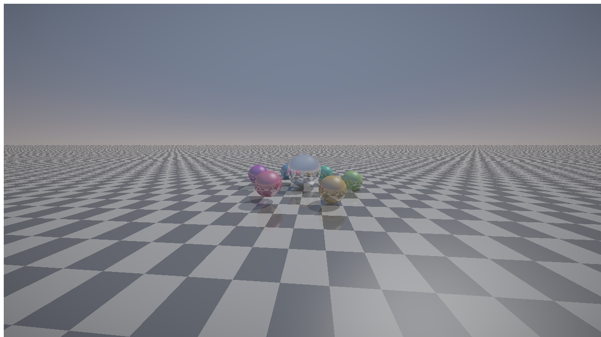

# Heaven 7 — WebGPU compute raytracer (prototype)

A single-file WebGPU proof-of-concept that renders a *Heaven 7*-style scene —
reflective spheres on an infinite checkered plane, phong shading, mirror
reflections, and soft shadows — using a **compute shader** (one thread per
pixel). It demonstrates that the software raytracer at the heart of Exceed's
2000 64k intro maps cleanly onto modern GPU compute.



## Run it

WebGPU needs a browser that supports it (Chrome/Edge 113+, Safari 18+, Firefox
Nightly) and a secure context (`https://` or `localhost`):

```bash
cd demos/heaven7-webgpu
python3 -m http.server 8080
# open http://localhost:8080/
```

Controls: quality (High 1×1 / Average 2×2 / Low 4×4 — the original settings
dialog's stages, here implemented as render scale), reflections on/off, and
the animated camera path.

## What this shows (and what it isn't)

This is a **feasibility prototype**, not a pixel-faithful port. The rendering
*math* is the same family the original uses — analytic ray/sphere and
ray/plane intersection, phong + specular, recursive mirror reflections — but
the scene here is a representative stand-in, not Heaven 7's actual scene
script. See `../../docs/heaven7-webgpu-assessment.md` for the full analysis of
the original binary and a staged plan for a faithful restoration.

The key structural change vs. the 2000 release: the original traced rays on a
single scalar x87 FPU and leaned on **adaptive 1×1 / 2×2 / 4×4 subsampling +
interpolation** to stay interactive on a Pentium-era CPU. On the GPU we run
full-resolution 1×1 for every pixel every frame, so the entire subsampling and
reconstruction subsystem — a large fraction of the original's hand-written MMX
code — simply disappears.

## Files

- `index.html` — the interactive demo (WebGPU init + compute raytracer WGSL +
  fullscreen blit). No build step, no dependencies.
- `preview.png` — a still captured by reading the compute output back off the
  GPU (headless Chromium does not composite the WebGPU swapchain into
  screenshots, so the still is produced via `copyTextureToBuffer`).
