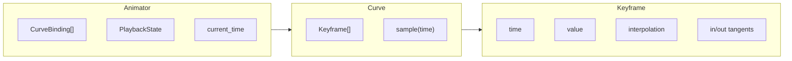
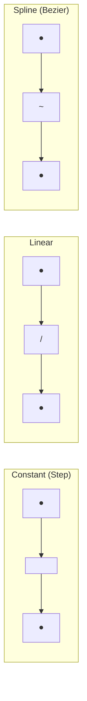
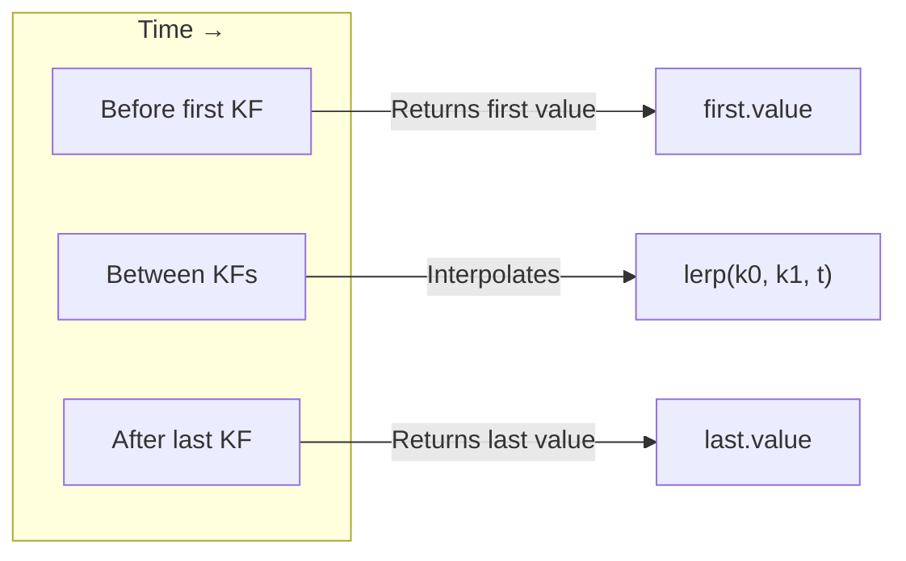
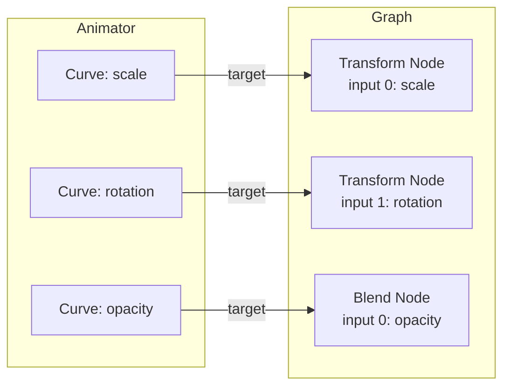
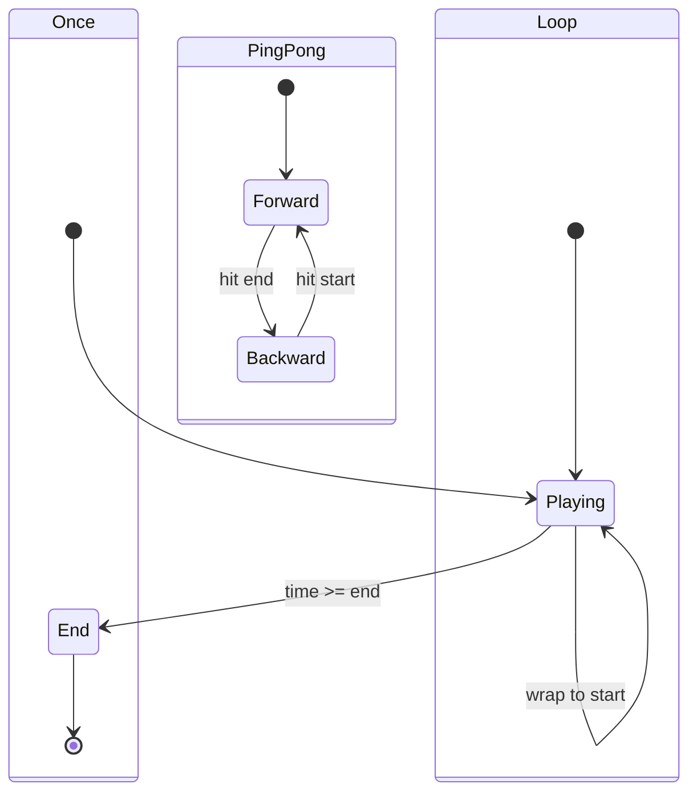

# Animation System

This document explains Flux's keyframe animation system for animating operator input values over time.

## Overview

The animation system provides:

- **Keyframe** - A value at a specific point in time
- **Curve** - A collection of keyframes that can be sampled
- **Animator** - Manages curves and playback for a symbol/graph



## Keyframes

A keyframe defines a value at a specific time:

```rust
pub struct Keyframe {
    pub time: f64,           // When (in seconds or bars)
    pub value: f64,          // What value
    pub in_type: Interpolation,   // How to arrive
    pub out_type: Interpolation,  // How to leave
    pub in_tangent: f64,     // For spline curves
    pub out_tangent: f64,    // For spline curves
}
```

### Creating Keyframes

```rust
use flux_graph::animation::Keyframe;

// Linear keyframe (default)
let kf = Keyframe::new(1.0, 100.0);

// Constant (step) keyframe
let kf = Keyframe::constant(1.0, 100.0);

// Spline keyframe with tangents
let kf = Keyframe::spline(1.0, 100.0, 0.5, 0.5);
```

## Interpolation Modes



| Mode | Behavior | Use Case |
|------|----------|----------|
| `Constant` | Value jumps instantly at keyframe | On/off switches, discrete states |
| `Linear` | Straight line between keyframes | Simple, predictable motion |
| `Spline` | Smooth curve with tangent control | Natural, organic motion |

### Interpolation Functions

```rust
use flux_graph::animation::Interpolation;

// Linear interpolation
let value = Interpolation::lerp(0.0, 100.0, 0.5);  // 50.0

// Smooth step (ease in/out)
let t = Interpolation::smoothstep(0.5);  // ~0.5 but with easing

// Hermite spline (with tangents)
let value = Interpolation::hermite(p0, m0, p1, m1, t);

// Cubic bezier
let value = Interpolation::cubic_bezier(p0, p1, p2, p3, t);
```

## Curves

A `Curve` is a collection of keyframes that can be sampled at any time:

```rust
use flux_graph::animation::{Curve, CurveBuilder};

// Using builder pattern
let mut curve = CurveBuilder::named("opacity")
    .keyframe(0.0, 0.0)    // Start at 0
    .keyframe(1.0, 1.0)    // Fade in
    .keyframe(3.0, 1.0)    // Hold
    .keyframe(4.0, 0.0)    // Fade out
    .build();

// Sample at any time
let value = curve.sample(0.5);   // 0.5 (midway through fade in)
let value = curve.sample(2.0);   // 1.0 (during hold)
let value = curve.sample(3.5);   // 0.5 (midway through fade out)
```

### Curve Sampling Behavior



### Curve Methods

```rust
// Add keyframes
curve.add(2.0, 50.0);              // Linear keyframe
curve.add_constant(2.0, 50.0);     // Step keyframe
curve.add_spline(2.0, 50.0, 0.0, 0.0);  // Spline with tangents

// Query
let (min_t, max_t) = curve.time_range().unwrap();
let (min_v, max_v) = curve.value_range().unwrap();
let keyframe = curve.get_keyframe(1.0);

// Modify
curve.remove_keyframe_at(1.0);
curve.clear();

// For visualization
let samples = curve.sample_range(0.0, 4.0, 100);  // 100 evenly spaced samples
```

## Animator

The `Animator` manages multiple curves and their playback:

```rust
use flux_graph::animation::{Animator, AnimatorBuilder, CurveBuilder, LoopMode};
use flux_core::Id;

let node_id = Id::new();

// Build an animator
let mut animator = AnimatorBuilder::new()
    .range(0.0, 4.0)           // Playback range
    .loop_mode(LoopMode::Loop) // Loop when finished
    .speed(1.0)                // Normal speed
    .curve(
        CurveBuilder::named("scale")
            .keyframe(0.0, 1.0)
            .keyframe(2.0, 2.0)
            .keyframe(4.0, 1.0)
            .build(),
        node_id,               // Target node
        0,                     // Input index
    )
    .build();
```

### Animation Targets

Each curve is bound to a specific input slot:

```rust
pub struct AnimationTarget {
    pub node_id: Id,       // Which operator
    pub input_index: usize, // Which input slot
}
```



### Playback Control

```rust
// State control
animator.play();
animator.pause();
animator.stop();     // Resets to start
animator.toggle_playback();

// Check state
if animator.is_playing() {
    // ...
}

// Time control
animator.set_time(2.0);         // Jump to time
animator.advance(delta_time);   // Advance by delta

// Playback settings
animator.set_speed(2.0);        // Double speed
animator.set_loop_mode(LoopMode::PingPong);
animator.set_range(0.0, 10.0);  // New range
```

### Loop Modes



| Mode | Behavior |
|------|----------|
| `Once` | Play once and stop at end |
| `Loop` | Jump back to start when reaching end |
| `PingPong` | Reverse direction at each end |

### Sampling Animated Values

```rust
// Sample a specific binding
let value = animator.sample(node_id, input_index);

// Sample all bindings at current time
let values: Vec<(AnimationTarget, f64)> = animator.sample_all();

// Get as Value map (for applying to graph)
let animated: HashMap<AnimationTarget, Value> = animator.get_animated_values();
```

## Integration with Graph

To apply animated values to a graph:

```rust
// Each frame:
animator.advance(delta_time);

// Get animated values
for (target, value) in animator.sample_all() {
    graph.set_input_default(target.node_id, target.input_index, Value::Float(value as f32));
}

// Evaluate
let result = graph.evaluate(output_node, 0, &ctx)?;
```

## Time Contexts

Flux supports multiple time contexts for nested compositions:

| Context | Field | Description |
|---------|-------|-------------|
| Global | `ctx.time` | Absolute time since start |
| Local | `ctx.local_time` | Time within current symbol |
| FX Local | `ctx.local_fx_time` | Time within effect/post-process |

Nested symbols can have their own animators with local time, enabling:
- Looping sub-animations
- Time-stretched nested compositions
- BPM-synced timing

## Best Practices

### 1. Use Builder Pattern for Complex Curves

```rust
let curve = CurveBuilder::named("bounce")
    .keyframe(0.0, 0.0)
    .keyframe(0.5, 1.0)
    .keyframe(0.7, 0.8)
    .keyframe(0.85, 1.0)
    .keyframe(0.95, 0.95)
    .keyframe(1.0, 1.0)
    .auto_tangents()  // Smooth spline
    .build();
```

### 2. Reuse Curves Across Targets

```rust
let fade_curve = CurveBuilder::new()
    .keyframe(0.0, 0.0)
    .keyframe(1.0, 1.0)
    .build();

animator.add_curve(fade_curve.clone(), node_a, 0);
animator.add_curve(fade_curve.clone(), node_b, 0);
```

### 3. Match Loop Mode to Content

- **Once** - For intro/outro sequences
- **Loop** - For background animations
- **PingPong** - For oscillating effects

### 4. Use Appropriate Interpolation

- **Constant** - Switches, triggers
- **Linear** - Mechanical motion, fades
- **Spline** - Character animation, natural motion

## See Also

- [Architecture](ARCHITECTURE.md) - System overview
- [Graph Evaluation](GRAPH_EVALUATION.md) - How values flow
- [Symbol/Instance](SYMBOL_INSTANCE.md) - Symbols store Animator
- [Example 14: Animation Curves](../examples/14_animation_curves.rs)
