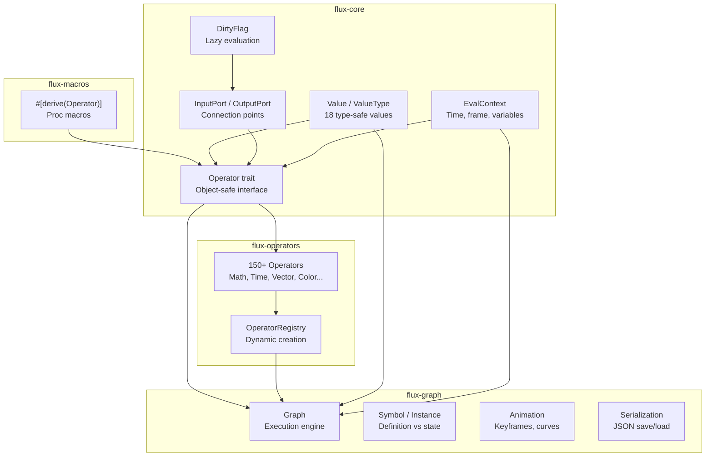
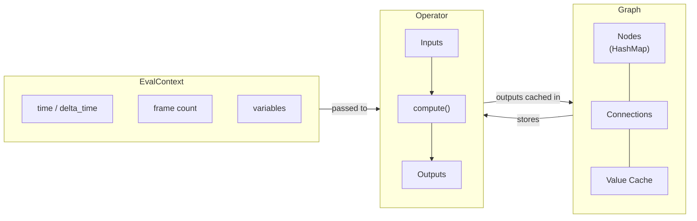
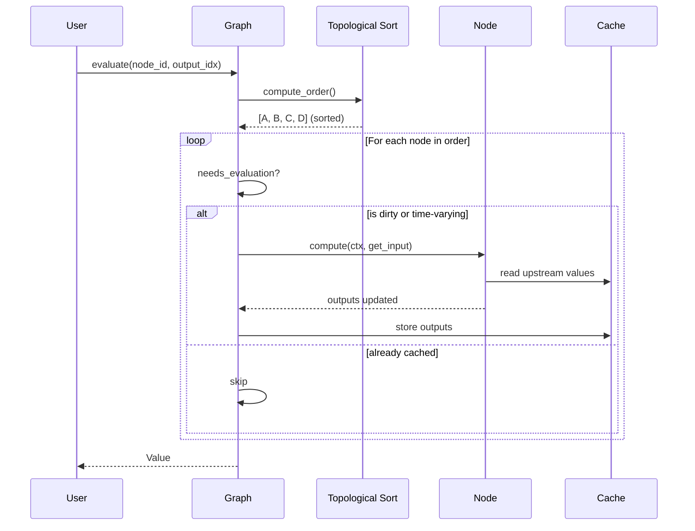
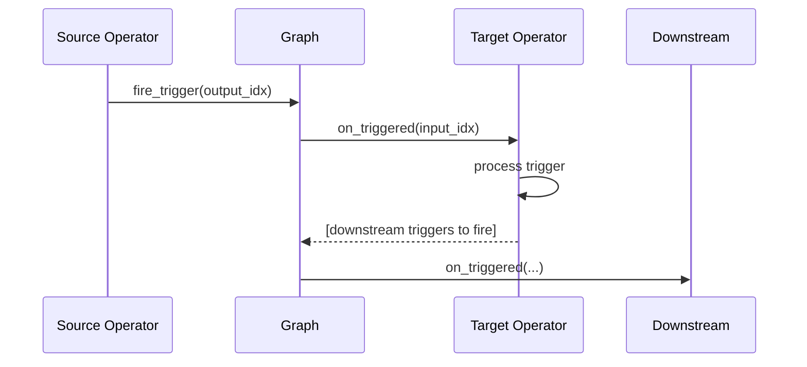

# Flux Architecture

This document provides a conceptual overview of Flux's architecture, helping you build the right mental model for using and contributing to the system.

## Design Philosophy

Flux is built on five core principles:

1. **Creative-first** - Optimized for real-time visual applications where experimentation matters more than strict type safety
2. **Reactive dataflow** - Values flow through connected operators automatically when inputs change
3. **Lazy evaluation** - Only recompute what changed (dirty flag tracking)
4. **Type safety with flexibility** - Strong typing with automatic coercion between compatible types
5. **Composable** - Build complex behaviors from simple operators

## Crate Structure

Flux is organized as a Cargo workspace with four crates, each with a clear responsibility:



### Crate Responsibilities

| Crate | Purpose | Key Types |
|-------|---------|-----------|
| **flux-core** | Foundation types and traits | `Value`, `Operator`, `InputPort`, `OutputPort`, `EvalContext`, `DirtyFlag` |
| **flux-operators** | Operator implementations | `AddOp`, `SineWaveOp`, `SwitchOp`, `OperatorRegistry` |
| **flux-graph** | Graph execution and persistence | `Graph`, `Symbol`, `CompiledGraph`, `Animation` |
| **flux-macros** | Code generation | `#[derive(Operator)]` |

## Core Abstractions

Flux is built around three core abstractions that work together:

### The Operator-Graph-Context Triad



**Operator** - A computational unit with typed inputs and outputs. Implements the `Operator` trait.

**Graph** - Container that stores operators, manages connections, and orchestrates evaluation. Handles topological sorting, caching, and dirty flag propagation.

**EvalContext** - Immutable context passed during evaluation containing timing (`time`, `delta_time`, `frame`), transform matrices, and user-defined variables.

### Value Flow

Values flow between operators through connections:

```
┌──────────────┐        ┌──────────────┐        ┌──────────────┐
│  Constant    │        │     Add      │        │   Multiply   │
│   5.0        │──out──▶│              │──out──▶│              │──▶ Result
└──────────────┘        │              │        │              │
┌──────────────┐        └──────────────┘        └──────────────┘
│  Constant    │────────────▲                          ▲
│   3.0        │                                       │
└──────────────┘        ┌──────────────┐               │
                        │  SineWave    │───────────────┘
                        │   ~time~     │
                        └──────────────┘
```

- Each operator has zero or more **InputPorts** and **OutputPorts**
- Connections link one output to one input
- Inputs can have **default values** used when not connected
- **Multi-input ports** can accept multiple connections (for variadic operations like `Sum`)

## Execution Models

Flux supports two execution models that can be combined:

### Pull-Based Evaluation (Default)

The standard model: request a value, and the graph computes only what's needed.



**Key points:**
- Evaluation is triggered by calling `graph.evaluate(node_id, output_index, &ctx)`
- Graph computes topological order (which nodes depend on which)
- Nodes are evaluated in dependency order
- Results are cached to avoid redundant computation
- Only dirty or time-varying nodes recompute

### Push-Based Execution (Triggers)

For event-driven workflows: a signal propagates forward immediately.



**Key points:**
- Operators can have `TriggerInput` and `TriggerOutput` ports
- When a trigger fires, connected operators receive `on_triggered()` calls
- The operator returns which of its trigger outputs should fire next
- Used for state machines, counters, sequencers, and event handling

### Comparing the Models

| Aspect | Pull (evaluate) | Push (triggers) |
|--------|-----------------|-----------------|
| Initiation | User requests output | Event fires trigger |
| Propagation | Backwards (dependencies) | Forwards (connections) |
| Caching | Yes | No (immediate) |
| Use case | Continuous values | Discrete events |
| Example | Animation values | Button clicks, state transitions |

## Data Flow Patterns

### Fan-Out and Fan-In

One output can connect to multiple inputs (fan-out), and multiple paths can merge (fan-in):

```
        ┌──▶ [Op B] ──┐
[Op A] ─┤             ├──▶ [Op D]   (diamond pattern)
        └──▶ [Op C] ──┘
```

**Why this matters:** Op A's output is computed once and cached, even though B and C both read it. When D is evaluated, A is not recomputed.

### Context-Aware Caching

When operators run inside loops or subroutines, each iteration needs its own cached values:

```
CacheKey = (node_id, call_context)

Loop iteration 0: CacheKey(NodeA, context_0) → Value_0
Loop iteration 1: CacheKey(NodeA, context_1) → Value_1
```

The `CallContext` (passed via `EvalContext`) ensures iterations don't share cached values incorrectly.

## What's Next

- **[Graph Evaluation](GRAPH_EVALUATION.md)** - Deep dive into evaluation, caching, and compiled execution
- **[Type System](TYPE_SYSTEM.md)** - Value types, categories, coercion rules
- **[Examples](../examples/README.md)** - Hands-on code examples
