# Flow Control

This document explains Flux's flow control operators for conditionals, loops, state management, and context variables.

## Overview

Flux provides 14 flow control operators organized into three categories:

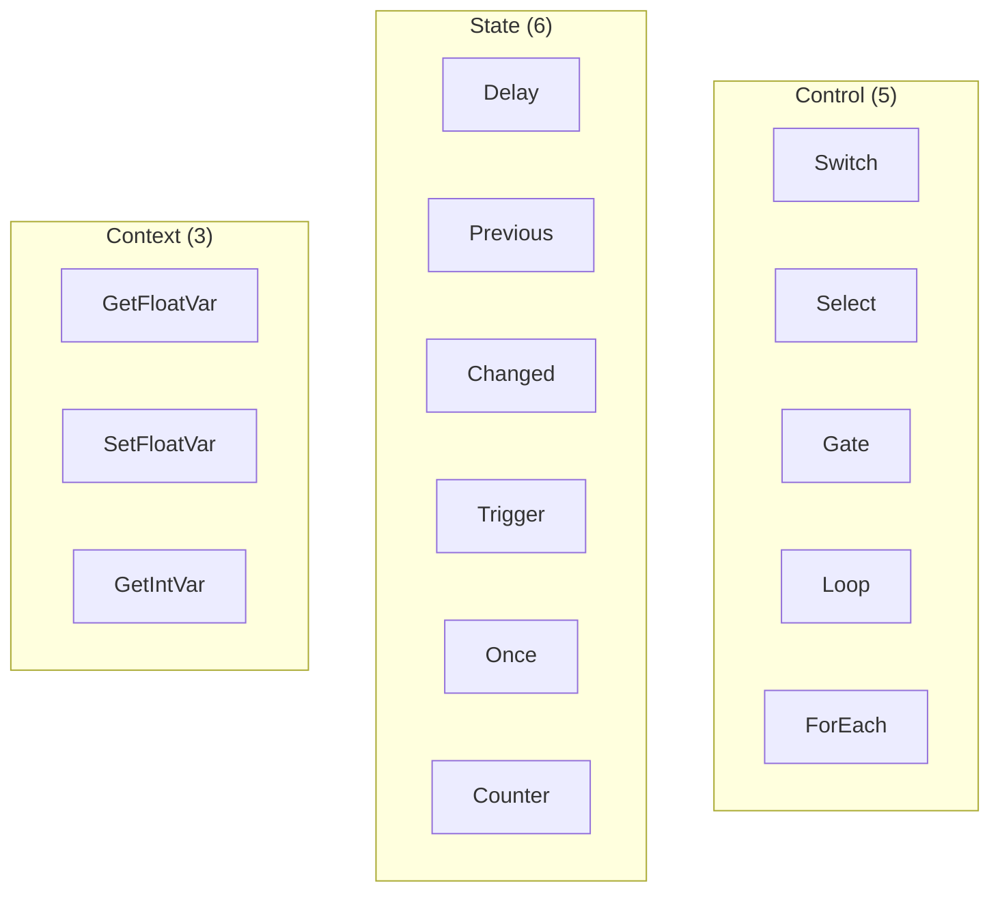

## Conditional Operators

### Switch

Selects between two values based on a boolean condition:

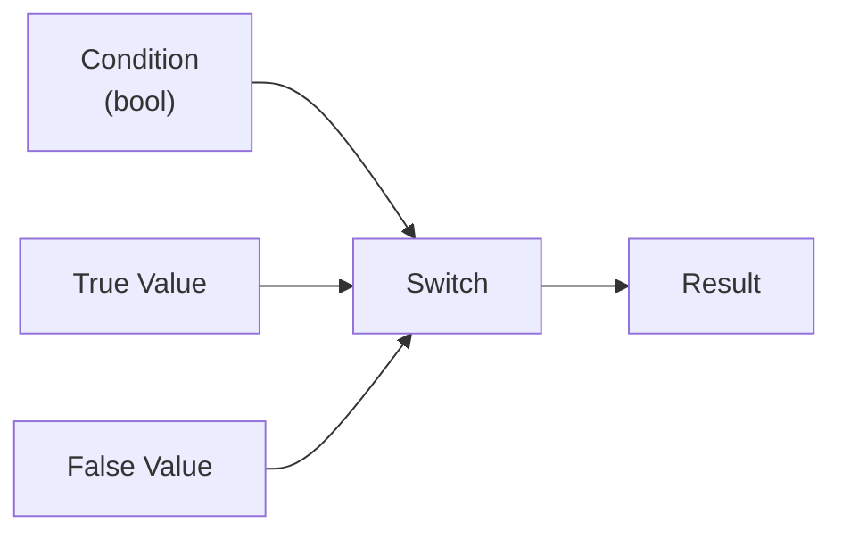

```rust
// If Condition is true, output True value; otherwise output False value
let mut switch = SwitchOp::new();
switch.inputs[0].default = Value::Bool(true);   // Condition
switch.inputs[1].default = Value::Float(10.0);  // True value
switch.inputs[2].default = Value::Float(5.0);   // False value
switch.compute(&ctx, &no_connections);
// Result: 10.0
```

**Use cases:**
- Toggle between modes
- A/B testing different values
- Enable/disable effects

### Select

Selects one value from multiple inputs by index:

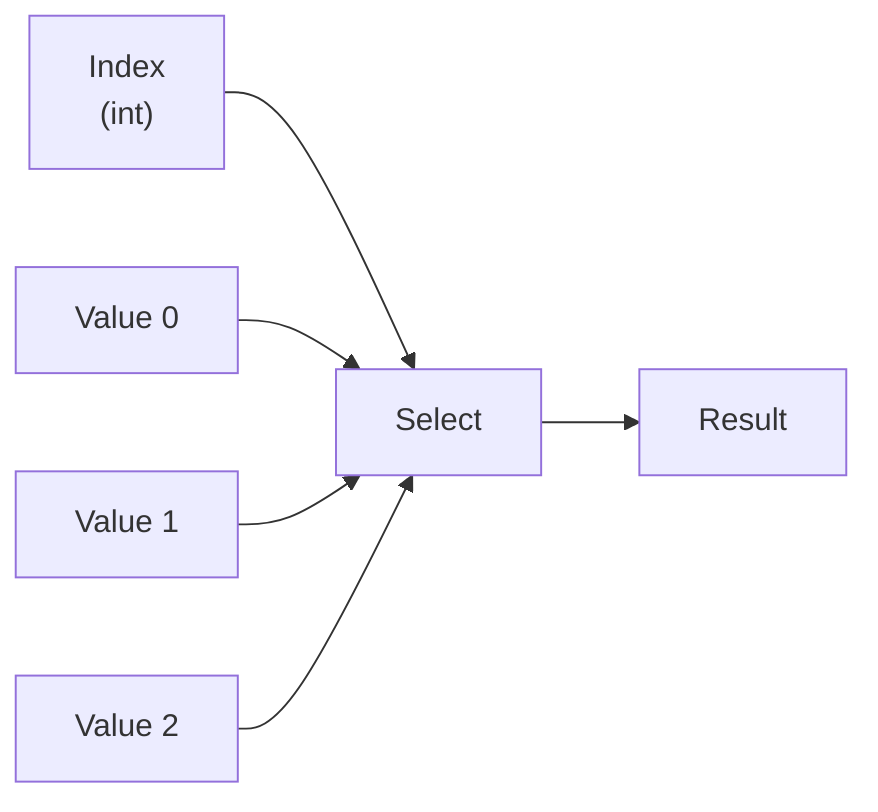

The "Values" input is a multi-input port - connect multiple sources, and the index determines which one passes through.

**Use cases:**
- Waveform selection (sine, square, triangle)
- Palette switching
- Animation phase selection

### Gate

Passes value through only when open; holds last value when closed:

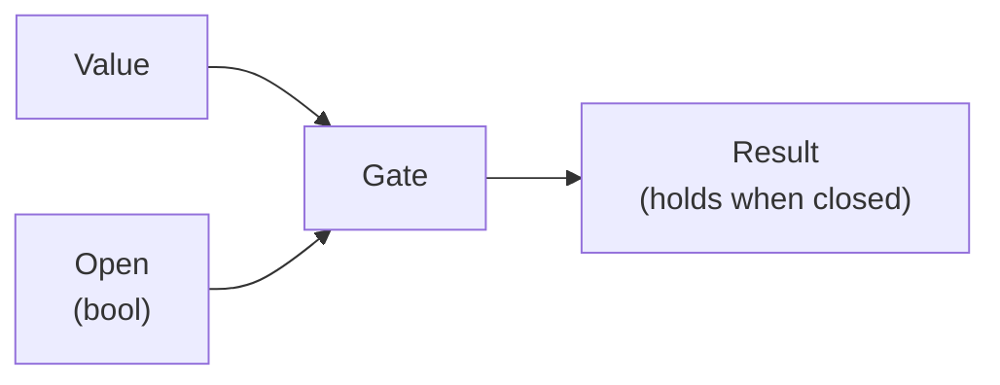

```rust
let mut gate = GateOp::new();
gate.inputs[0].default = Value::Float(42.0);  // Value
gate.inputs[1].default = Value::Bool(true);   // Open
gate.compute(&ctx, &no_connections);
// Result: 42.0

gate.inputs[1].default = Value::Bool(false);  // Close gate
gate.inputs[0].default = Value::Float(100.0); // New value ignored
gate.compute(&ctx, &no_connections);
// Result: 42.0 (held from when gate was open)
```

**Use cases:**
- Sample and hold
- Freeze animation at specific time
- Value locking

## Loop Operators

Flux provides trigger-based iteration through `Loop` and `ForEach` operators.

### Loop

Executes a body N times, providing the current iteration index:

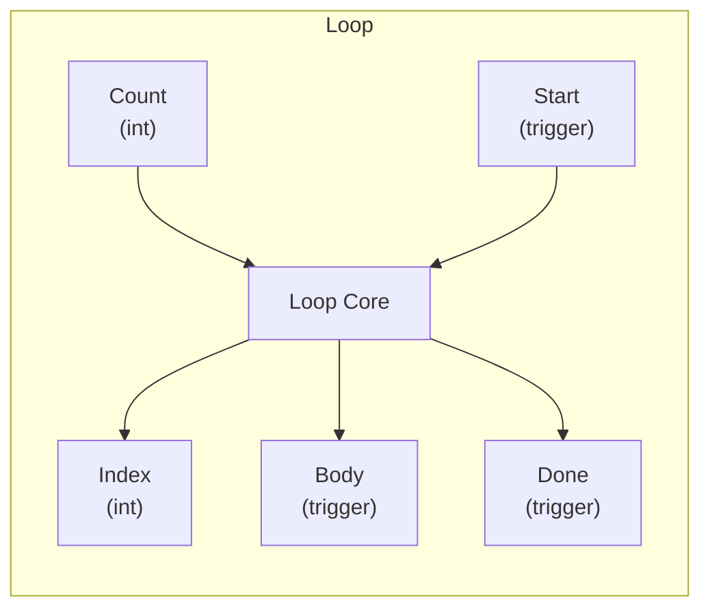

| Port | Direction | Type | Description |
|------|-----------|------|-------------|
| Count | Input | Int | Number of iterations |
| Start | Trigger In | - | Begins the loop |
| Index | Output | Int | Current iteration (0 to N-1) |
| Body | Trigger Out | - | Fired once per iteration |
| Done | Trigger Out | - | Fired when loop completes |

```rust
let mut loop_op = LoopOp::new();
loop_op.inputs[0].default = Value::Int(3);  // Count = 3
loop_op.compute(&ctx, &no_connections);

// First trigger - index 0
let triggers = loop_op.on_triggered(0, &ctx, &no_connections);
// Index output: 0, triggers: [Body]

// Second trigger - index 1
let triggers = loop_op.on_triggered(0, &ctx, &no_connections);
// Index output: 1, triggers: [Body]

// Third trigger - index 2 (last iteration)
let triggers = loop_op.on_triggered(0, &ctx, &no_connections);
// Index output: 2, triggers: [Body, Done]
```

### ForEach

Iterates over list elements:

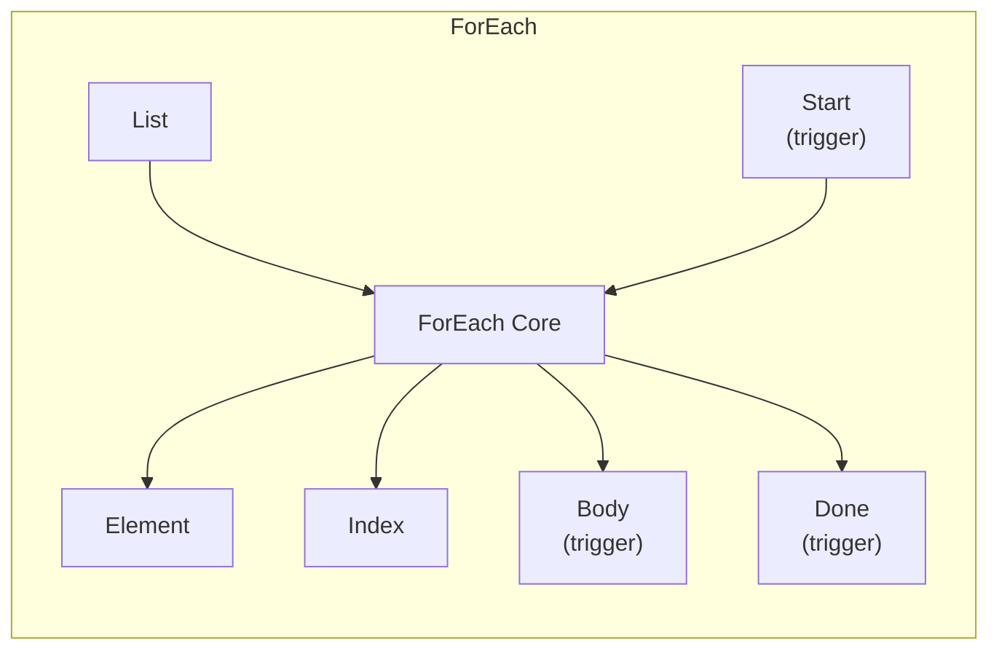

| Port | Direction | Type | Description |
|------|-----------|------|-------------|
| List | Input | FloatList | List to iterate over |
| Start | Trigger In | - | Begins iteration |
| Element | Output | Float | Current list element |
| Index | Output | Int | Current index |
| Body | Trigger Out | - | Fired for each element |
| Done | Trigger Out | - | Fired when complete |

**Use cases:**
- Process each point in a path
- Apply transformation to list elements
- Aggregate values

## State Operators

State operators maintain values between evaluations, enabling temporal patterns.

### Delay

Delays a value by N frames:

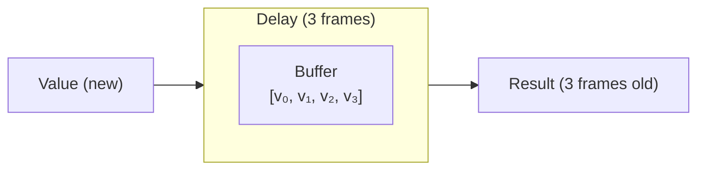

```rust
let mut delay = DelayOp::new();
delay.inputs[1].default = Value::Int(2);  // 2 frame delay

// Frame 1: input 10.0
delay.inputs[0].default = Value::Float(10.0);
delay.compute(&ctx, &no_connections);
// Output: 0.0 (buffer not yet filled)

// Frame 2: input 20.0
delay.inputs[0].default = Value::Float(20.0);
delay.compute(&ctx, &no_connections);
// Output: 0.0 (buffer still filling)

// Frame 3: input 30.0
delay.inputs[0].default = Value::Float(30.0);
delay.compute(&ctx, &no_connections);
// Output: 10.0 (value from 2 frames ago)
```

### Previous

Returns the value from the previous frame:

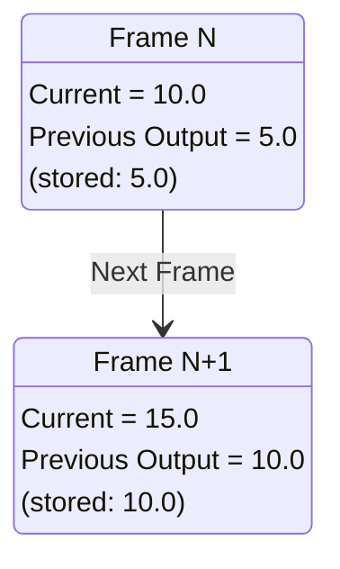

**Use cases:**
- Velocity calculation (current - previous)
- Edge detection
- Smoothing/damping

### Changed

Detects when a value changes between frames:

```rust
let mut changed = ChangedOp::new();

// First frame - always considered "changed"
changed.inputs[0].default = Value::Float(10.0);
changed.compute(&ctx, &no_connections);
// Output: true

// Same value
changed.compute(&ctx, &no_connections);
// Output: false

// New value
changed.inputs[0].default = Value::Float(20.0);
changed.compute(&ctx, &no_connections);
// Output: true
```

### Trigger (Rising Edge)

Outputs true only on rising edge (false→true transition):

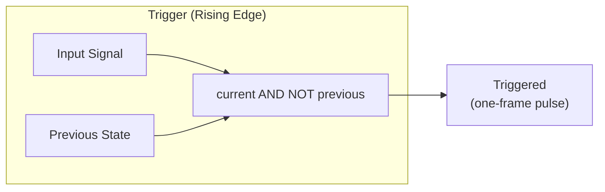

| Previous | Current | Output |
|----------|---------|--------|
| false | false | false |
| false | true | **true** |
| true | true | false |
| true | false | false |

**Use cases:**
- Button press detection
- Beat triggers from BPM
- One-shot events

### Once

Executes once and remembers the result until reset:

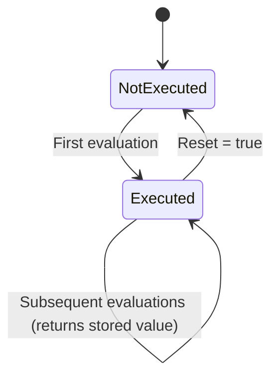

```rust
let mut once = OnceOp::new();

// First evaluation captures value
once.inputs[0].default = Value::Float(42.0);
once.compute(&ctx, &no_connections);
// Output: 42.0, stored

// Value changes but output stays the same
once.inputs[0].default = Value::Float(100.0);
once.compute(&ctx, &no_connections);
// Output: 42.0 (stored value)

// Reset
once.inputs[1].default = Value::Bool(true);
once.compute(&ctx, &no_connections);

// Now captures new value
once.inputs[1].default = Value::Bool(false);
once.inputs[0].default = Value::Float(99.0);
once.compute(&ctx, &no_connections);
// Output: 99.0 (new stored value)
```

**Use cases:**
- Initialize once at startup
- Capture value at specific moment
- Random seed generation

### Counter

Counts trigger events:

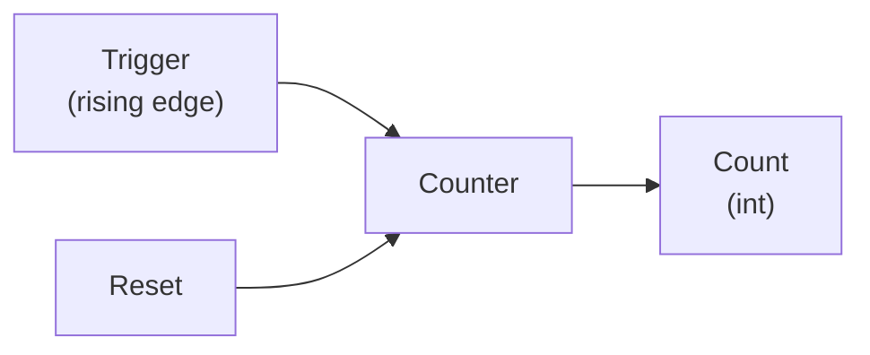

```rust
let mut counter = CounterOp::new();

counter.compute(&ctx, &no_connections);
// Count: 0

// Trigger (false → true)
counter.inputs[0].default = Value::Bool(true);
counter.compute(&ctx, &no_connections);
// Count: 1

// Stay high - no increment
counter.compute(&ctx, &no_connections);
// Count: 1

// Trigger again
counter.inputs[0].default = Value::Bool(false);
counter.compute(&ctx, &no_connections);
counter.inputs[0].default = Value::Bool(true);
counter.compute(&ctx, &no_connections);
// Count: 2

// Reset
counter.inputs[1].default = Value::Bool(true);
counter.compute(&ctx, &no_connections);
// Count: 0
```

**Use cases:**
- Beat counting
- Event tracking
- Cycle through modes

## Context Variables

Context variables allow passing values between operators without explicit connections.

### GetFloatVar / GetIntVar

Retrieves a named variable from the evaluation context:

```rust
let mut get_var = GetFloatVarOp::new();
get_var.inputs[0].default = Value::String("speed".into());  // Variable name
get_var.inputs[1].default = Value::Float(1.0);              // Default if not found

let mut ctx = EvalContext::new();
ctx.set_float_var("speed", 2.5);

get_var.compute(&ctx, &no_connections);
// Output: 2.5
```

### SetFloatVar

Sets a variable in the context and passes the value through:

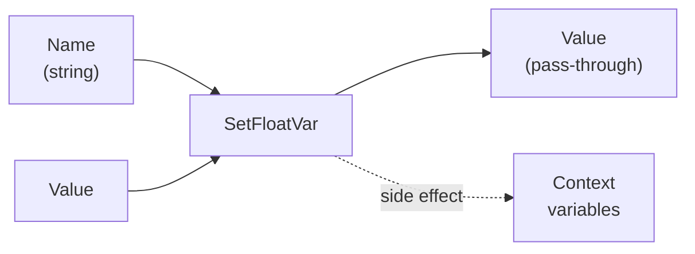

```rust
let mut set_var = SetFloatVarOp::new();
set_var.inputs[0].default = Value::String("result".into());
set_var.inputs[1].default = Value::Float(42.0);

set_var.compute(&ctx, &no_connections);
// Output: 42.0 (pass-through)
// Context now has "result" = 42.0
```

**Use cases:**
- Share values across disconnected graph sections
- Store intermediate results
- Cross-symbol communication

## Time-Varying Operators

Some operators are marked `is_time_varying() = true`, which means they may produce different outputs even with the same inputs. This affects caching:

| Operator | Time-Varying | Why |
|----------|--------------|-----|
| Delay | Yes | Internal buffer state |
| Previous | Yes | Remembers last value |
| Changed | Yes | Compares to previous |
| Trigger | Yes | Tracks previous input |
| Counter | Yes | Accumulates count |
| Switch | No | Pure function |
| Select | No | Pure function |
| Gate | No* | Holds value (but deterministic per frame) |

## Common Patterns

### Pulse on Change

Detect when a value changes and emit a single-frame pulse:

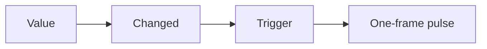

### Beat-Synced Counter

Count beats within a measure:

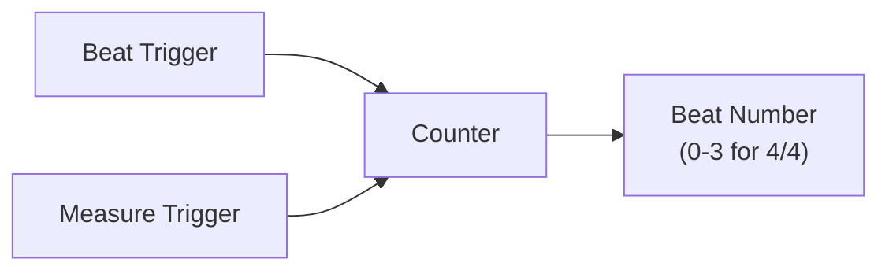

### Sample and Hold with Trigger

Capture a value only when triggered:

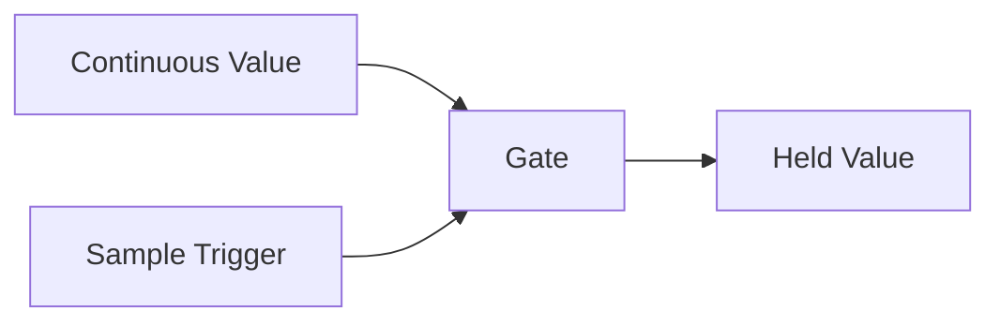

### Smooth Transitions

Use Previous to calculate deltas for smoothing:

```rust
// current_value - previous_value = delta
// smoothed = previous + delta * smoothing_factor
```

### Toggle State

Use Counter with modulo for toggling:

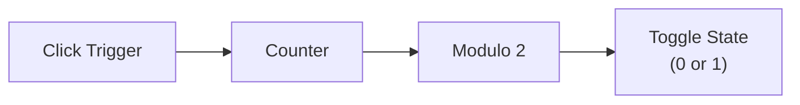

## Best Practices

### 1. Use Appropriate Trigger Detection

- **Changed**: For any value type, any magnitude change
- **Trigger**: For boolean signals, rising edge only
- **Counter**: When you need to count occurrences

### 2. Initialize State Properly

State operators start with default values:
- **Previous**: Returns `0.0` on first frame
- **Changed**: Returns `true` on first frame
- **Counter**: Starts at `0`

### 3. Consider Buffer Filling Time

**Delay** needs N+1 frames to fill its buffer before outputting delayed values. During filling, it outputs `0.0`.

### 4. Reset State When Needed

Most state operators have Reset inputs or can be reset:
- **Once**: Reset input clears stored value
- **Counter**: Reset input clears count
- Use these to reinitialize at composition start

### 5. Avoid Circular Dependencies

Be careful with state operators in feedback loops:
```
❌ Value → Previous → Add → Value (circular)
✓  Value → Previous → Different output
```

## See Also

- [Architecture](ARCHITECTURE.md) - Execution models (pull vs push)
- [Graph Evaluation](GRAPH_EVALUATION.md) - How operators are evaluated
- [List Operations](LIST_OPERATIONS.md) - Working with collections
- [Example 08: Flow Control](../examples/08_flow_control.rs)
