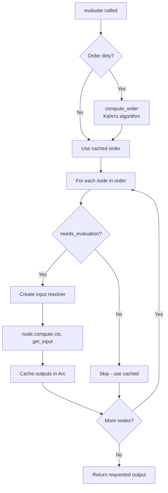
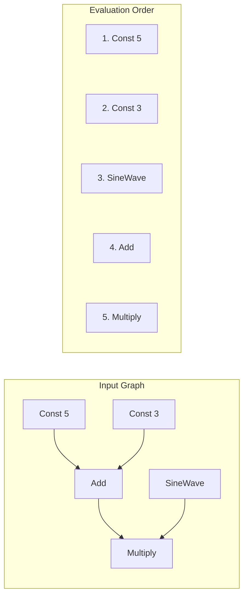
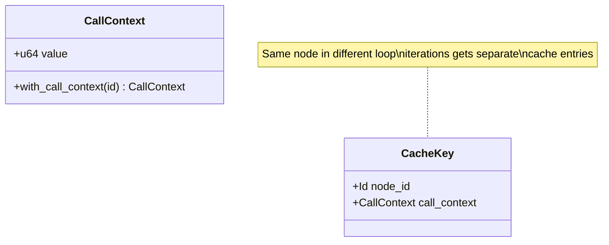
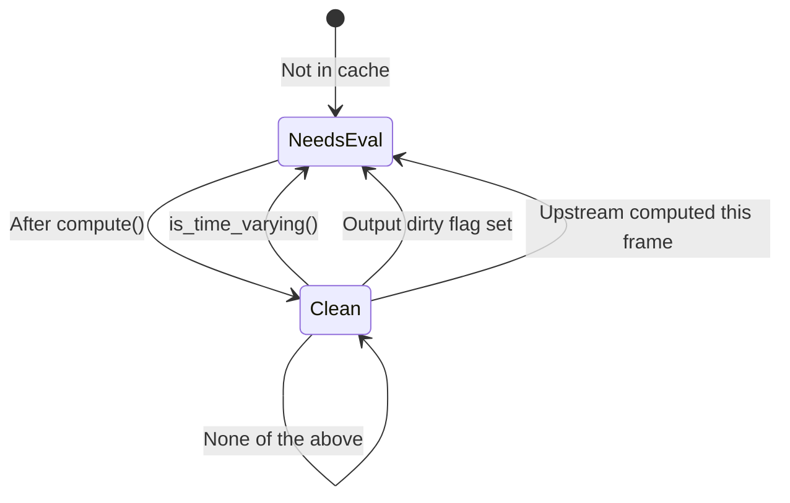
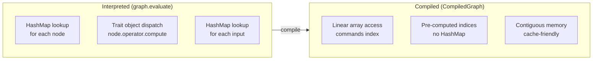
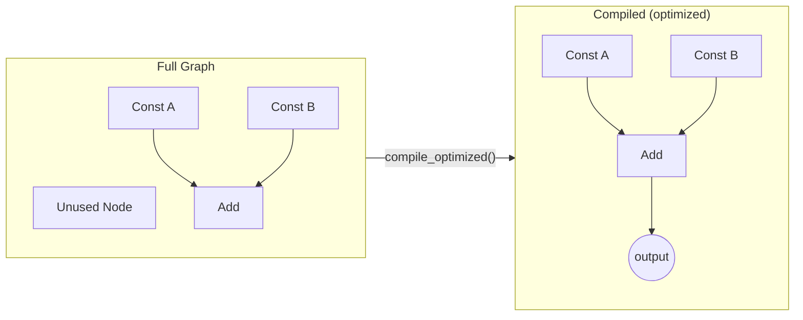

# Graph Evaluation

This document explains how Flux evaluates operator graphs, including the caching system, lazy evaluation, and compiled execution mode.

## Evaluation Lifecycle

When you call `graph.evaluate(node_id, output_index, &ctx)`, Flux performs these steps:



### Topological Ordering

The graph maintains nodes in **topological order** - a sequence where every node appears after its dependencies. This is computed using Kahn's algorithm:



The order is recomputed only when the graph structure changes (`order_dirty` flag).

### Input Resolution

During `compute()`, operators receive an `InputResolver` closure to fetch upstream values:

```rust
let get_input = |source_id: Id, output_idx: usize| -> Value {
    // Look up in value cache using CacheKey
    cache.get(&CacheKey { node_id: source_id, call_context })
        .and_then(|outputs| outputs.get(output_idx))
        .unwrap_or_default()
};

node.operator.compute(ctx, &get_input);
```

Operators don't need to know about the graph structure - they just call `get_input(source_id, idx)` for connected inputs.

## Caching System

Flux caches computed values to avoid redundant work.

### CacheKey: Context-Aware Isolation

The cache key combines two pieces of information:



**Why CallContext matters:** When an operator runs inside a loop or subroutine, each iteration needs isolated cached values:

```
Loop iteration 0: CacheKey(AddOp, context_0) → 5.0
Loop iteration 1: CacheKey(AddOp, context_1) → 10.0
Loop iteration 2: CacheKey(AddOp, context_2) → 15.0
```

Without context isolation, all iterations would share the same cached value - incorrect behavior.

### Cache Invalidation

The cache is invalidated when:

| Trigger | What happens |
|---------|--------------|
| Connection added/removed | `invalidate_cache_for_node(target)` |
| Input default changed | `invalidate_cache_for_node(node)` |
| Node removed | `invalidate_cache_for_node(node)` |
| Manual clear | `graph.clear_cache()` |

## Lazy Evaluation

Not every node recomputes on every frame. The `needs_evaluation()` function determines this:



### When Nodes Recompute

| Condition | Recomputes? | Example |
|-----------|-------------|---------|
| Never computed (not in cache) | Yes | First frame |
| `is_time_varying() == true` | Yes | SineWave, Time |
| Any output has dirty flag | Yes | Input default changed |
| Upstream node computed this frame | Yes | Dependency chain |
| None of the above | No | Static constant |

### DirtyFlag Triggers

Each output port has a `DirtyFlag` with a trigger mode:

| Trigger | Behavior |
|---------|----------|
| `None` | Only dirty when explicitly marked |
| `Always` | Always recompute |
| `Animated` | Dirty when version changes or global invalidation |
| `TimeChanged` | Dirty when `ctx.time` differs from last eval |
| `FrameChanged` | Dirty when `ctx.frame` differs from last eval |

```rust
// Example: Time-varying operator
impl Operator for SineWaveOp {
    fn is_time_varying(&self) -> bool {
        true  // Always recomputes
    }
}

// Example: Pure operator (only recomputes when inputs change)
impl Operator for AddOp {
    fn is_time_varying(&self) -> bool {
        false  // Only when dirty
    }
}
```

## Compiled Execution

For performance-critical paths, Flux offers a two-tier execution model inspired by Werkkzeug4.

### Interpreted vs Compiled



### Compilation Process

```rust
// Compile once (when graph structure changes)
let compiled = graph.compile(output_node, 0)?;

// Execute many times (every frame)
for frame in 0..1000 {
    ctx.advance(1.0 / 60.0);
    let result = compiled.execute(&mut graph, &ctx);
}
```

**What compilation does:**

1. Snapshots the topological order
2. Assigns contiguous buffer indices to all outputs
3. Pre-computes input→output mappings
4. Creates a linear command buffer

### Dead Code Elimination

`compile_optimized()` traces dependencies backward and excludes unreachable nodes:

```rust
let compiled = graph.compile_optimized(output_node, 0)?;
// Only includes nodes that contribute to output_node
```



The unused node is eliminated because it doesn't contribute to the output.

### When to Use Compiled Execution

| Scenario | Recommendation |
|----------|----------------|
| Interactive editing | **Interpreted** - Graph changes frequently |
| Playback / export | **Compiled** - Structure is stable |
| Small graphs (<20 nodes) | Either - Overhead difference is minimal |
| Large graphs (100+ nodes) | **Compiled** - Noticeable speedup |
| Debugging | **Interpreted** - Easier to inspect |

## Best Practices

### 1. Mark Time-Varying Operators Correctly

```rust
fn is_time_varying(&self) -> bool {
    // Return true if output depends on ctx.time or ctx.frame
    // This ensures proper recomputation
    true
}
```

### 2. Use set() Not Direct Assignment

```rust
// Good - marks output as clean
self.outputs[0].set(Value::Float(result));

// Bad - dirty flag not updated
self.outputs[0].value = Value::Float(result);
```

### 3. Minimize Cache Clearing

```rust
// Avoid - clears everything
graph.clear_cache();

// Better - changes trigger targeted invalidation
graph.set_input_default(node, 0, new_value);
```

### 4. Recompile When Structure Changes

```rust
// Graph structure changed
graph.add(new_op);
graph.connect(a, 0, b, 0)?;

// Must recompile for compiled execution
let compiled = graph.compile(output, 0)?;
```

## See Also

- [Architecture](ARCHITECTURE.md) - System overview
- [Type System](TYPE_SYSTEM.md) - Value types and coercion
- [Example 16: Dirty Flag System](../examples/16_dirty_flag_system.rs)
- [Example 21: Compiled Execution](../examples/21_compiled_execution.rs)
- [Example 23: Performance Benchmark](../examples/23_performance_benchmark.rs)
