# List Operations

This document explains Flux's list operations for creating, transforming, and iterating over collections.

## Overview

Flux provides 40 list operators organized into categories:

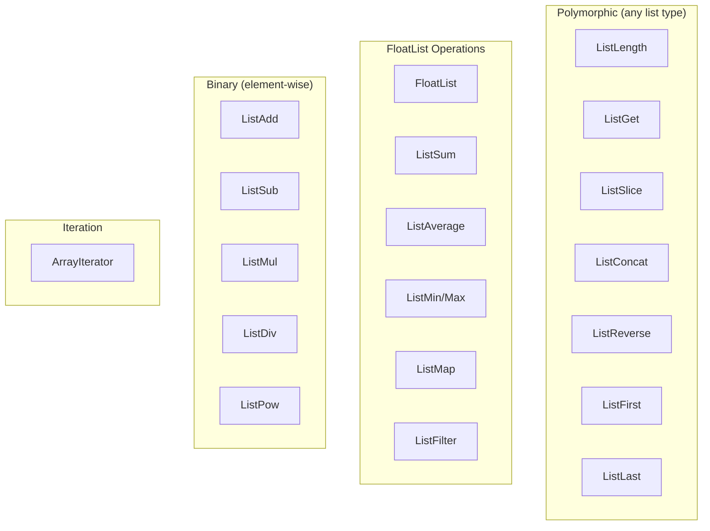

## List Types

Flux supports 8 list types corresponding to scalar types:

| List Type | Element Type | Example |
|-----------|--------------|---------|
| `FloatList` | Float | `[1.0, 2.0, 3.0]` |
| `IntList` | Int | `[1, 2, 3]` |
| `BoolList` | Bool | `[true, false, true]` |
| `Vec2List` | Vec2 | `[[0,0], [1,1]]` |
| `Vec3List` | Vec3 | `[[0,0,0], [1,1,1]]` |
| `Vec4List` | Vec4 | `[[0,0,0,0], [1,1,1,1]]` |
| `ColorList` | Color | `[RED, GREEN, BLUE]` |
| `StringList` | String | `["a", "b", "c"]` |

## Creating Lists

### FloatList / IntList

Create lists from multiple inputs using multi-input ports:

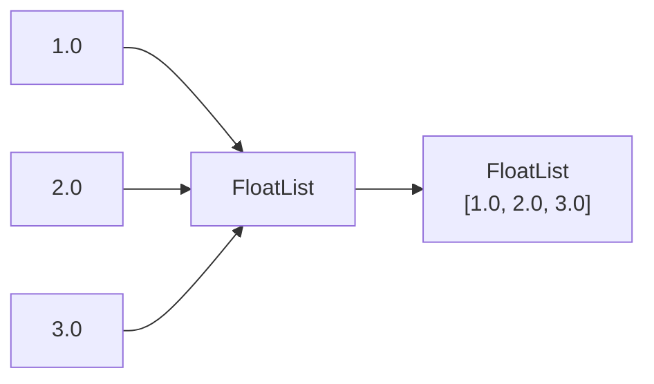

```rust
// FloatList accepts multiple float connections
let mut op = FloatListOp::new();
// Connect multiple float outputs to the "Values" multi-input port
// Or set default:
op.inputs[0].default = Value::float_list(vec![1.0, 2.0, 3.0]);
```

### IntListRange

Generate sequential integers:

```rust
// Creates [start, start+1, ..., end-1]
let mut range = IntListRangeOp::new();
range.inputs[0].default = Value::Int(0);   // Start
range.inputs[1].default = Value::Int(10);  // End (exclusive)
// Output: [0, 1, 2, 3, 4, 5, 6, 7, 8, 9]
```

## Polymorphic Operators

These operators work with any list type:

### ListLength

Returns the number of elements:

```rust
let mut op = ListLengthOp::new();
op.inputs[0].default = Value::float_list(vec![1.0, 2.0, 3.0, 4.0, 5.0]);
op.compute(&ctx, &no_connections);
// Output: 5 (Int)
```

### ListGet

Access element by index (supports negative indexing):

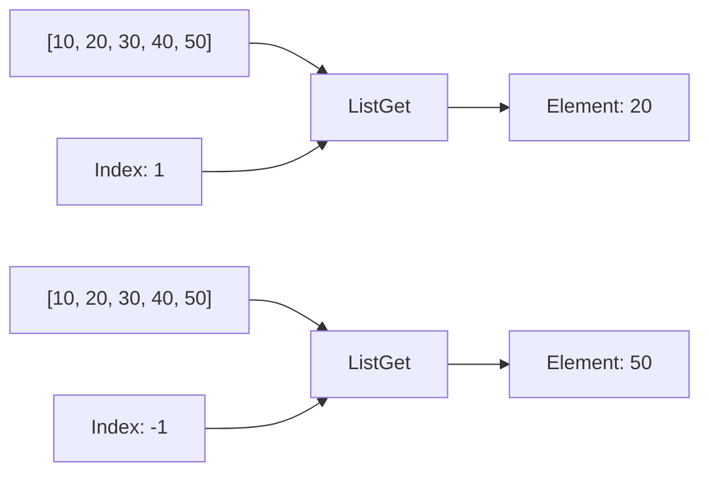

| Index | Result |
|-------|--------|
| 0 | First element |
| 1, 2, ... | Subsequent elements |
| -1 | Last element |
| -2 | Second to last |
| Out of range | Default value |

```rust
let mut op = ListGetOp::new();
op.inputs[0].default = Value::float_list(vec![10.0, 20.0, 30.0]);
op.inputs[1].default = Value::Int(-1);  // Last element
op.compute(&ctx, &no_connections);
// Output: 30.0
```

### ListSlice

Extract a portion of a list (Python-style slicing):

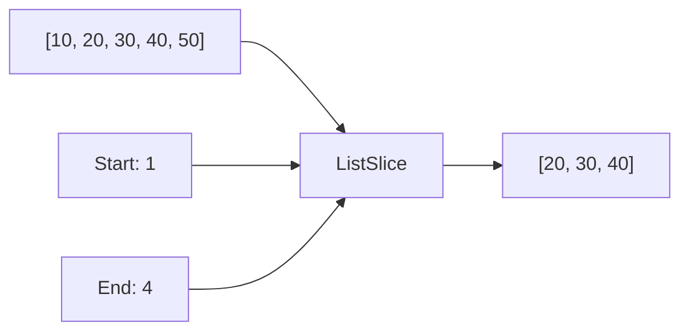

| Slice | Input | Result |
|-------|-------|--------|
| `[1:3]` | `[10,20,30,40,50]` | `[20,30]` |
| `[0:3]` | `[10,20,30,40,50]` | `[10,20,30]` |
| `[-2:-1]` | `[10,20,30,40,50]` | `[40]` |
| `[2:]` | `[10,20,30,40,50]` | `[30,40,50]` |

```rust
let mut op = ListSliceOp::new();
op.inputs[0].default = Value::float_list(vec![10.0, 20.0, 30.0, 40.0, 50.0]);
op.inputs[1].default = Value::Int(1);   // Start (inclusive)
op.inputs[2].default = Value::Int(3);   // End (exclusive)
op.compute(&ctx, &no_connections);
// Output: [20.0, 30.0]
```

### ListConcat

Join two lists of the same type:

```rust
let mut op = ListConcatOp::new();
op.inputs[0].default = Value::float_list(vec![1.0, 2.0]);
op.inputs[1].default = Value::float_list(vec![3.0, 4.0, 5.0]);
op.compute(&ctx, &no_connections);
// Output: [1.0, 2.0, 3.0, 4.0, 5.0]
```

### ListReverse / ListFirst / ListLast

```rust
// ListReverse: [1, 2, 3] → [3, 2, 1]
// ListFirst: [10, 20, 30] → 10
// ListLast: [10, 20, 30] → 30
```

## FloatList Operations

### Aggregation

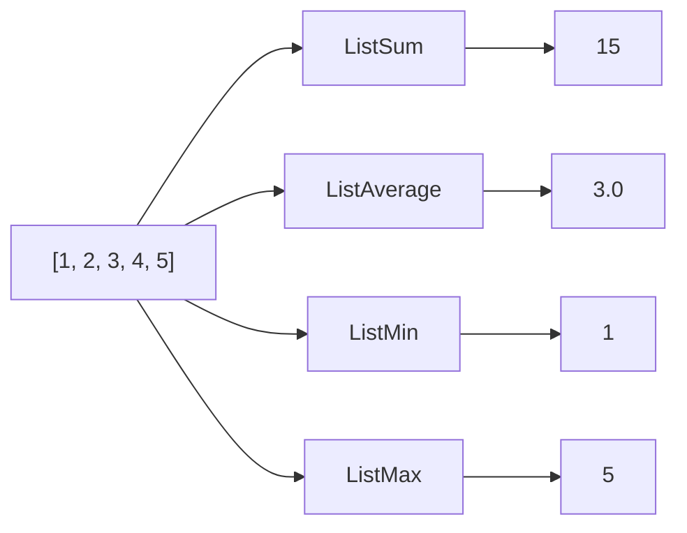

| Operator | Input | Output |
|----------|-------|--------|
| ListSum | `[1,2,3,4]` | `10` |
| ListAverage | `[2,4,6,8]` | `5.0` |
| ListMin | `[5,2,8,1,9]` | `1` |
| ListMax | `[5,2,8,1,9]` | `9` |

### ListMap (Scale & Offset)

Transform all elements: `output[i] = input[i] * scale + offset`

```rust
let mut op = ListMapOp::new();
op.inputs[0].default = Value::float_list(vec![1.0, 2.0, 3.0]);
op.inputs[1].default = Value::Float(2.0);   // Scale
op.inputs[2].default = Value::Float(10.0);  // Offset
op.compute(&ctx, &no_connections);
// Output: [12.0, 14.0, 16.0]
// (1*2+10, 2*2+10, 3*2+10)
```

### ListFilter

Filter elements by threshold comparison:

| Mode | Comparison |
|------|------------|
| 0 | Greater than (GT) |
| 1 | Less than (LT) |
| 2 | Greater or equal (GTE) |
| 3 | Less or equal (LTE) |

```rust
let mut op = ListFilterOp::new();
op.inputs[0].default = Value::float_list(vec![1.0, 5.0, 2.0, 8.0, 3.0]);
op.inputs[1].default = Value::Float(3.0);   // Threshold
op.inputs[2].default = Value::Int(0);       // Mode: GT
op.compute(&ctx, &no_connections);
// Output: [5.0, 8.0] (values > 3)
```

## Binary List Operations

Element-wise operations using zip-shortest semantics (result length = min of input lengths):

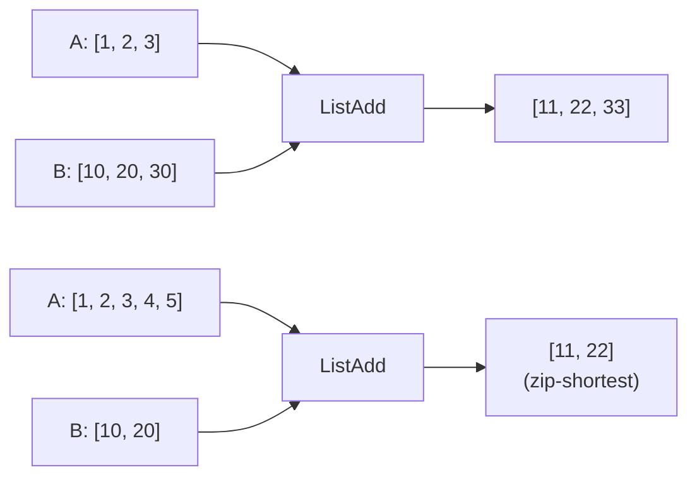

| Operator | Operation | Example |
|----------|-----------|---------|
| ListAdd | A + B | `[1,2] + [10,20]` → `[11,22]` |
| ListSub | A - B | `[10,20] - [1,2]` → `[9,18]` |
| ListMul | A * B | `[2,3] * [5,6]` → `[10,18]` |
| ListDiv | A / B | `[10,20] / [2,5]` → `[5,4]` |
| ListPow | A ^ B | `[2,3] ^ [2,2]` → `[4,9]` |

**Note:** ListDiv returns `0.0` for division by zero (safe division).

## ArrayIterator

Trigger-based iteration over any list type:

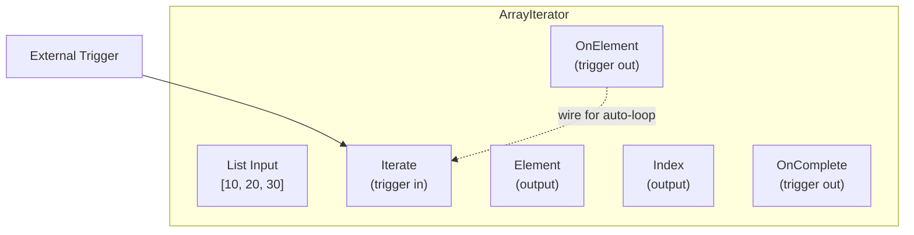

| Port | Direction | Type | Description |
|------|-----------|------|-------------|
| List | Input | Any list | Collection to iterate |
| Iterate | Trigger In | - | Advances to next element |
| Element | Output | Matches list | Current element value |
| Index | Output | Int | Current index (0-based) |
| OnElement | Trigger Out | - | Fires after outputting element |
| OnComplete | Trigger Out | - | Fires when iteration ends |

### Manual Stepping

Trigger `Iterate` once per desired element:

```rust
let mut iter = ArrayIterator::new();
iter.inputs[0].default = Value::float_list(vec![10.0, 20.0, 30.0]);
iter.compute(&ctx, &no_connections);

// First trigger
let triggers = iter.on_triggered(0, &ctx, &no_connections);
// Element: 10.0, Index: 0, triggers: [OnElement]

// Second trigger
let triggers = iter.on_triggered(0, &ctx, &no_connections);
// Element: 20.0, Index: 1, triggers: [OnElement]

// Third trigger (last element)
let triggers = iter.on_triggered(0, &ctx, &no_connections);
// Element: 30.0, Index: 2, triggers: [OnElement, OnComplete]
```

### Auto-Loop Pattern

Wire `OnElement` → `Iterate` for automatic iteration through all elements:

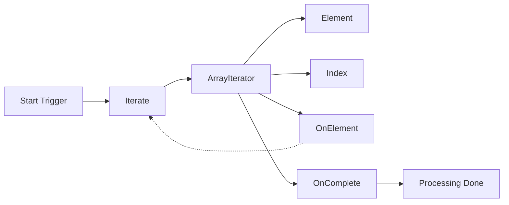

## Type-Specific Operators

### IntList

- **IntList**: Create from multiple int inputs
- **IntListSum**: Sum all integers
- **IntListMin/Max**: Integer extrema
- **IntListRange**: Generate sequential integers

### Vec3List

- **Vec3List**: Create from Vec3 inputs
- **Vec3ListNormalize**: Normalize all vectors
- **Vec3ListCentroid**: Compute center point
- **Vec3ListBounds**: Get bounding box

### ColorList

- **ColorList**: Create from color inputs
- **ColorListSample**: Sample at normalized position
- **ColorListBlend**: Blend adjacent colors

## Conversions

Convert between list types:

| Operator | From | To |
|----------|------|---|
| IntListToFloatList | IntList | FloatList |
| FloatListToIntList | FloatList | IntList (truncated) |
| Vec3ListFlatten | Vec3List | FloatList (3x length) |
| FloatListToVec3List | FloatList | Vec3List (1/3 length) |
| ColorListToVec4List | ColorList | Vec4List |
| Vec4ListToColorList | Vec4List | ColorList |

## Common Patterns

### Normalize Values to 0-1

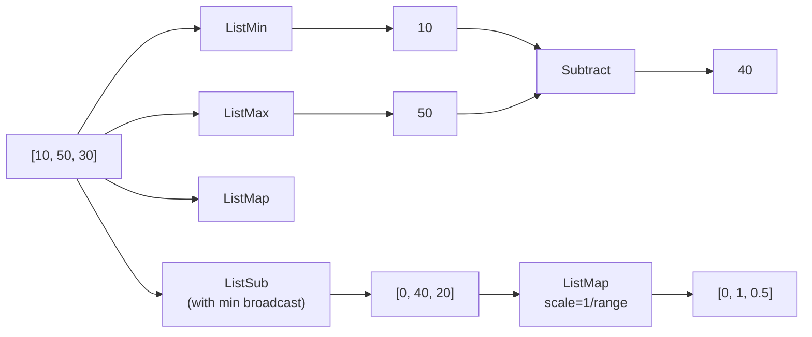

### Running Sum (Cumulative)

Use ArrayIterator with accumulator:

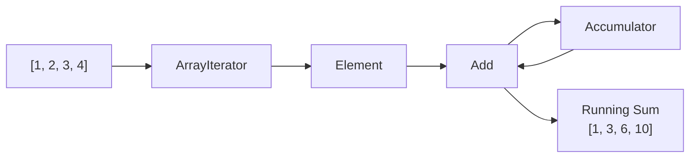

### Filter and Count

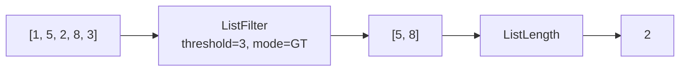

### Point Processing

Process 3D points as Vec3List:

```rust
// Create points
let points = Value::vec3_list(vec![
    [0.0, 0.0, 0.0],
    [1.0, 0.0, 0.0],
    [0.5, 1.0, 0.0],
]);

// Compute centroid
let centroid = vec3_list_centroid(&points);

// Normalize all points
let normalized = vec3_list_normalize(&points);

// Get bounding box
let (min_bound, max_bound) = vec3_list_bounds(&points);
```

## Best Practices

### 1. Use Polymorphic Operators When Possible

Polymorphic operators (ListLength, ListGet, ListSlice, etc.) work with any list type, reducing the need for type-specific code.

### 2. Prefer Element-wise Operations Over Iteration

Binary list operations (ListAdd, ListMul, etc.) are more efficient than manual iteration with ArrayIterator for simple transformations.

### 3. Handle Empty Lists

Most operators handle empty lists gracefully:
- Aggregations return `0` or `0.0`
- ListGet returns default value
- ArrayIterator fires OnComplete immediately

### 4. Mind Zip-Shortest Semantics

Binary operations truncate to the shorter list:
```
[1, 2, 3, 4, 5] + [10, 20] = [11, 22]
```

### 5. Type Coercion in Concat

ListConcat attempts to coerce the second list to match the first:
```rust
// FloatList + IntList → FloatList (if coercion succeeds)
```

## See Also

- [Type System](TYPE_SYSTEM.md) - List type definitions and coercion
- [Flow Control](FLOW_CONTROL.md) - ForEach operator (trigger-based)
- [Example 13: List Operations](../examples/13_list_operations.rs)
- [Example 28: Polymorphic Collections](../examples/28_polymorphic_collections.rs)
