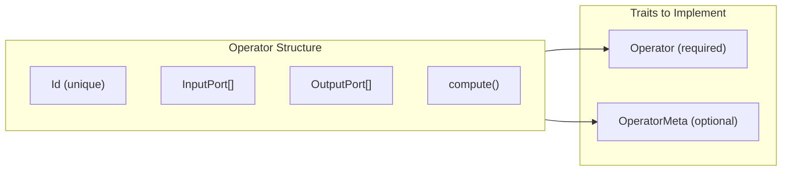
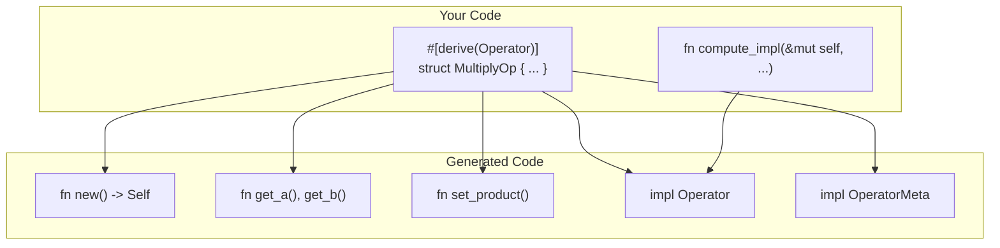
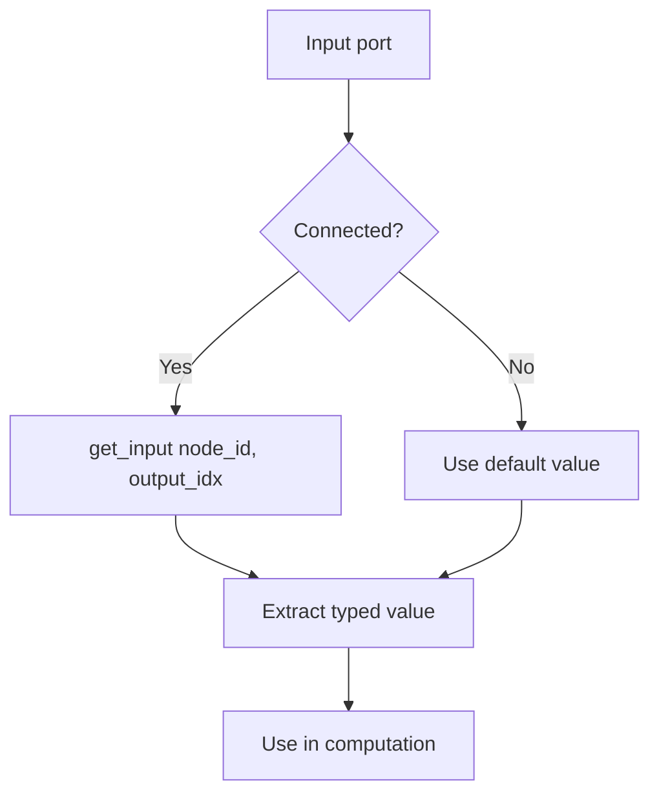
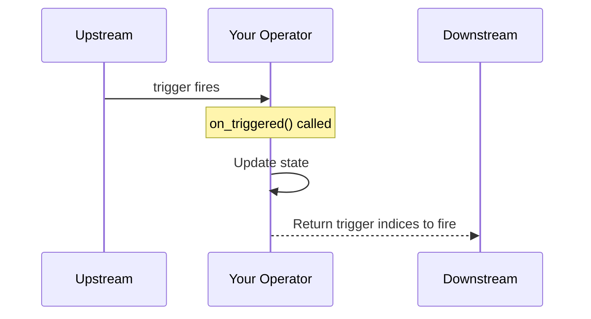

# Operator Guide

This guide explains how to create custom operators in Flux, covering both manual implementation and the derive macro approach.

## Overview

Operators are the computational units in Flux. Each operator:
- Has a unique `Id` for identification
- Defines typed input and output ports
- Implements a `compute()` function that transforms inputs to outputs



## The Operator Trait

All operators must implement the `Operator` trait from `flux_core`:

```rust
pub trait Operator: Any {
    // Required: Identification
    fn id(&self) -> Id;
    fn name(&self) -> &'static str;

    // Required: Port access
    fn inputs(&self) -> &[InputPort];
    fn inputs_mut(&mut self) -> &mut [InputPort];
    fn outputs(&self) -> &[OutputPort];
    fn outputs_mut(&mut self) -> &mut [OutputPort];

    // Required: Computation
    fn compute(&mut self, ctx: &EvalContext, get_input: InputResolver);

    // Required: Downcasting support
    fn as_any(&self) -> &dyn Any;
    fn as_any_mut(&mut self) -> &mut dyn Any;

    // Optional: Optimization hints
    fn is_time_varying(&self) -> bool { false }
    fn can_operate_in_place(&self) -> bool { false }

    // Optional: Trigger ports (push-based execution)
    fn trigger_inputs(&self) -> &[TriggerInput] { &[] }
    fn trigger_outputs(&self) -> &[TriggerOutput] { &[] }
    fn on_triggered(&mut self, trigger_index: usize, ctx: &EvalContext,
                    get_input: InputResolver) -> Vec<usize> { vec![] }
}
```

## Creating Operators Manually

Here's a complete example of a manually implemented operator:

```rust
use std::any::Any;
use flux_core::{
    EvalContext, Id, InputPort, InputResolver, Operator,
    OperatorMeta, OutputPort, PinShape, PortMeta, Value,
};

pub struct MultiplyOp {
    id: Id,
    inputs: [InputPort; 2],   // Fixed-size array for known port count
    outputs: [OutputPort; 1],
}

impl MultiplyOp {
    pub fn new() -> Self {
        Self {
            id: Id::new(),
            inputs: [
                InputPort::float("A", 1.0),
                InputPort::float("B", 1.0),
            ],
            outputs: [OutputPort::float("Product")],
        }
    }
}

impl Operator for MultiplyOp {
    fn as_any(&self) -> &dyn Any { self }
    fn as_any_mut(&mut self) -> &mut dyn Any { self }

    fn id(&self) -> Id { self.id }
    fn name(&self) -> &'static str { "Multiply" }

    fn inputs(&self) -> &[InputPort] { &self.inputs }
    fn inputs_mut(&mut self) -> &mut [InputPort] { &mut self.inputs }

    fn outputs(&self) -> &[OutputPort] { &self.outputs }
    fn outputs_mut(&mut self) -> &mut [OutputPort] { &mut self.outputs }

    fn compute(&mut self, _ctx: &EvalContext, get_input: InputResolver) {
        // Resolve input A
        let a = match self.inputs[0].connection {
            Some((node_id, output_idx)) => {
                get_input(node_id, output_idx).as_float().unwrap_or(1.0)
            }
            None => self.inputs[0].default.as_float().unwrap_or(1.0),
        };

        // Resolve input B
        let b = match self.inputs[1].connection {
            Some((node_id, output_idx)) => {
                get_input(node_id, output_idx).as_float().unwrap_or(1.0)
            }
            None => self.inputs[1].default.as_float().unwrap_or(1.0),
        };

        // Set output (marks it as clean)
        self.outputs[0].set_float(a * b);
    }
}

// Optional: UI metadata
impl OperatorMeta for MultiplyOp {
    fn category(&self) -> &'static str { "Math" }
    fn description(&self) -> &'static str { "Multiplies A by B" }

    fn input_meta(&self, index: usize) -> Option<PortMeta> {
        match index {
            0 => Some(PortMeta::new("A")),
            1 => Some(PortMeta::new("B")),
            _ => None,
        }
    }

    fn output_meta(&self, index: usize) -> Option<PortMeta> {
        match index {
            0 => Some(PortMeta::new("Product").with_shape(PinShape::TriangleFilled)),
            _ => None,
        }
    }
}
```

## Using the Derive Macro

The `#[derive(Operator)]` macro reduces boilerplate significantly:

```rust
use flux_macros::Operator;
use flux_core::{Id, InputPort, OutputPort, EvalContext, InputResolver};

#[derive(Operator)]
#[operator(name = "Multiply", category = "Math")]
#[operator(description = "Multiplies A by B")]
#[operator(category_color = [0.35, 0.35, 0.55, 1.0])]
struct MultiplyOp {
    _id: Id,                      // Prefix with _ (marker field)
    _inputs: Vec<InputPort>,      // Prefix with _ (marker field)
    _outputs: Vec<OutputPort>,    // Prefix with _ (marker field)

    #[input(label = "A", default = 1.0)]
    a: f32,

    #[input(label = "B", default = 1.0)]
    b: f32,

    #[output(label = "Product")]
    product: f32,
}

impl MultiplyOp {
    // The macro calls this from compute()
    fn compute_impl(&mut self, _ctx: &EvalContext, get_input: InputResolver) {
        let a = self.get_a(get_input);  // Generated getter
        let b = self.get_b(get_input);  // Generated getter
        self.set_product(a * b);        // Generated setter
    }
}
```

### What the Macro Generates



The macro generates:
- `new()` constructor with proper port initialization
- `get_<field>()` methods for each `#[input]` field
- `set_<field>()` methods for each `#[output]` field
- Complete `Operator` trait implementation
- Complete `OperatorMeta` trait implementation

### Macro Attributes

**Struct-level (`#[operator(...)]`):**

| Attribute | Required | Description |
|-----------|----------|-------------|
| `name` | No | Display name (defaults to struct name) |
| `category` | No | Category for grouping (defaults to "Uncategorized") |
| `description` | No | Description text |
| `category_color` | No | RGBA color `[r, g, b, a]` |
| `icon` | No | Icon identifier |

**Input fields (`#[input(...)]`):**

| Attribute | Required | Description |
|-----------|----------|-------------|
| `label` | No | Display label (defaults to field name) |
| `default` | No | Default value when not connected |
| `range` | No | UI range hint `(min, max)` |
| `unit` | No | Unit string (e.g., "Hz", "ms") |
| `shape` | No | Pin shape (defaults to "CircleFilled") |

**Output fields (`#[output(...)]`):**

| Attribute | Required | Description |
|-----------|----------|-------------|
| `label` | No | Display label |
| `unit` | No | Unit string |
| `shape` | No | Pin shape (defaults to "TriangleFilled") |

## Input Resolution Pattern

The `compute()` function receives an `InputResolver` closure to fetch upstream values:



### Manual Resolution

```rust
fn compute(&mut self, _ctx: &EvalContext, get_input: InputResolver) {
    let value = match self.inputs[0].connection {
        Some((node_id, output_idx)) => {
            // Fetch from connected upstream node
            get_input(node_id, output_idx)
                .as_float()
                .unwrap_or(0.0)
        }
        None => {
            // Use default value
            self.inputs[0].default.as_float().unwrap_or(0.0)
        }
    };
    // ...
}
```

### With Derive Macro

```rust
fn compute_impl(&mut self, _ctx: &EvalContext, get_input: InputResolver) {
    let value = self.get_value(get_input);  // Handles connection check internally
    // ...
}
```

## Time-Varying Operators

Operators that depend on `ctx.time` or `ctx.frame` should return `true` from `is_time_varying()`:

```rust
impl Operator for SineWaveOp {
    fn is_time_varying(&self) -> bool {
        true  // Recompute every frame
    }

    fn compute(&mut self, ctx: &EvalContext, _get_input: InputResolver) {
        let frequency = self.get_frequency();
        self.outputs[0].set_float((ctx.time * frequency * std::f64::consts::TAU).sin() as f32);
    }
}
```

**Why this matters:** Non-time-varying operators only recompute when their inputs change, saving CPU cycles.

## Trigger Ports (Push-Based)

For event-driven operators, implement trigger ports:



```rust
pub struct CounterOp {
    id: Id,
    outputs: [OutputPort; 1],
    trigger_inputs: [TriggerInput; 1],
    trigger_outputs: [TriggerOutput; 1],
    count: i32,
}

impl CounterOp {
    pub fn new() -> Self {
        Self {
            id: Id::new(),
            outputs: [OutputPort::int("Count")],
            trigger_inputs: [TriggerInput::new("Increment")],
            trigger_outputs: [TriggerOutput::new("Changed")],
            count: 0,
        }
    }
}

impl Operator for CounterOp {
    // ... standard methods ...

    fn trigger_inputs(&self) -> &[TriggerInput] {
        &self.trigger_inputs
    }

    fn trigger_outputs(&self) -> &[TriggerOutput] {
        &self.trigger_outputs
    }

    fn on_triggered(
        &mut self,
        trigger_index: usize,
        _ctx: &EvalContext,
        _get_input: InputResolver,
    ) -> Vec<usize> {
        if trigger_index == 0 {  // "Increment" trigger
            self.count += 1;
            self.outputs[0].set_int(self.count);
            vec![0]  // Fire "Changed" trigger
        } else {
            vec![]
        }
    }
}
```

## Registering Operators

To make operators available for dynamic creation (e.g., from saved files):

```rust
use flux_operators::registry::{OperatorRegistry, OperatorWithMeta};

fn register_my_operators(registry: &mut OperatorRegistry) {
    // Simple registration
    registry.register_with_meta("MyOp", || {
        let op = MyOp::new();
        let meta = vec![
            op.input_meta(0),
            op.input_meta(1),
        ];
        (Box::new(op), meta)
    });

    // Parameterized registration
    registry.register_parameterized_with_meta("CompareOp", |params| {
        let mode = params.get_int("mode", 0);
        let op = CompareOp::new(CompareMode::from(mode));
        let meta = vec![op.input_meta(0), op.input_meta(1)];
        (Box::new(op), meta)
    });
}
```

## Port Types

### Input Port Constructors

| Constructor | Type | Example |
|-------------|------|---------|
| `InputPort::float(name, default)` | Float | `InputPort::float("Value", 0.0)` |
| `InputPort::int(name, default)` | Int | `InputPort::int("Count", 0)` |
| `InputPort::bool(name, default)` | Bool | `InputPort::bool("Enable", true)` |
| `InputPort::arithmetic(name, default)` | Polymorphic | Accepts Float, Int, Vec2-4, Color |
| `InputPort::any(name, default)` | Any | Accepts all types |

### Output Port Constructors

| Constructor | Type |
|-------------|------|
| `OutputPort::float(name)` | Float |
| `OutputPort::int(name)` | Int |
| `OutputPort::bool(name)` | Bool |
| `OutputPort::vec3(name)` | Vec3 |
| `OutputPort::color(name)` | Color |

### Setting Output Values

Always use setter methods to properly update dirty flags:

```rust
// Good - marks output as clean
self.outputs[0].set_float(result);
self.outputs[0].set_int(count);
self.outputs[0].set(Value::Vec3([x, y, z]));

// Bad - dirty flag not updated
self.outputs[0].value = Value::Float(result);
```

## Best Practices

### 1. Use Fixed-Size Arrays When Possible

```rust
// Prefer this (no allocation)
inputs: [InputPort; 2],

// Over this (heap allocation)
inputs: Vec<InputPort>,
```

### 2. Handle Missing Connections Gracefully

```rust
let value = get_input(node_id, output_idx)
    .as_float()
    .unwrap_or(self.inputs[0].default.as_float().unwrap_or(0.0));
```

### 3. Mark Time-Varying Operators

```rust
fn is_time_varying(&self) -> bool {
    true  // If you use ctx.time or ctx.frame
}
```

### 4. Implement OperatorMeta for UI Integration

```rust
impl OperatorMeta for MyOp {
    fn category(&self) -> &'static str { "MyCategory" }
    fn description(&self) -> &'static str { "What this operator does" }
    // Port metadata for visual node editors
}
```

## See Also

- [Architecture](ARCHITECTURE.md) - System overview
- [Graph Evaluation](GRAPH_EVALUATION.md) - How operators are executed
- [Type System](TYPE_SYSTEM.md) - Value types and coercion
- [Example 04: Custom Operators](../examples/04_custom_operators.rs)
- [Example 05: Operator Derive Macro](../examples/05_operator_derive.rs)
