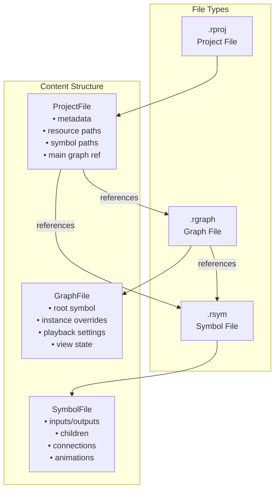
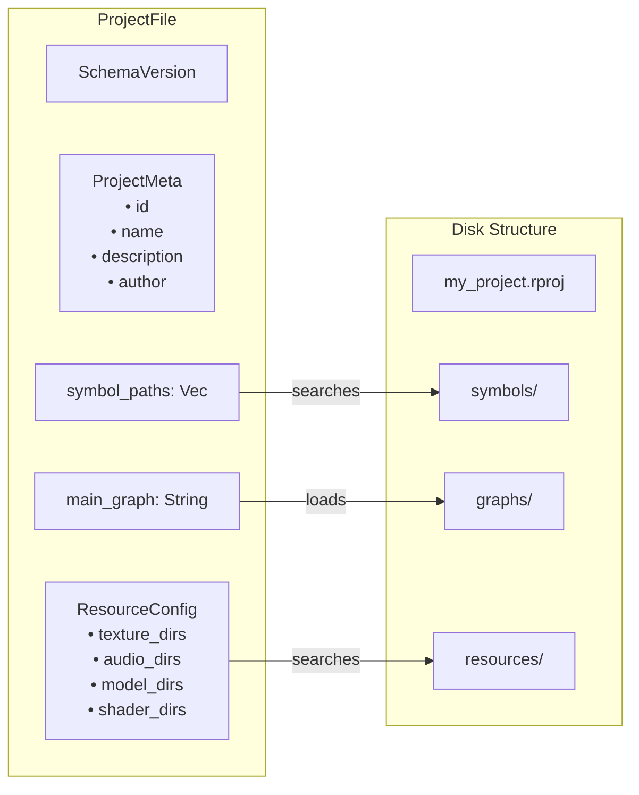
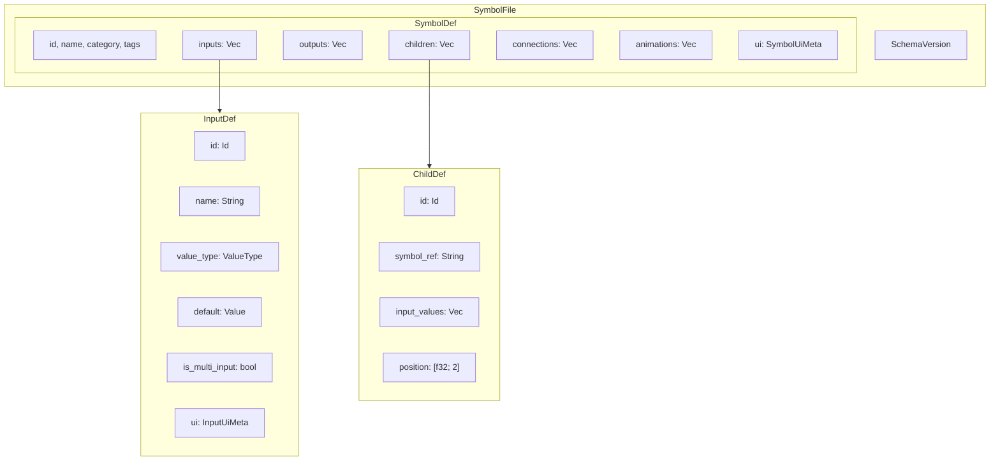
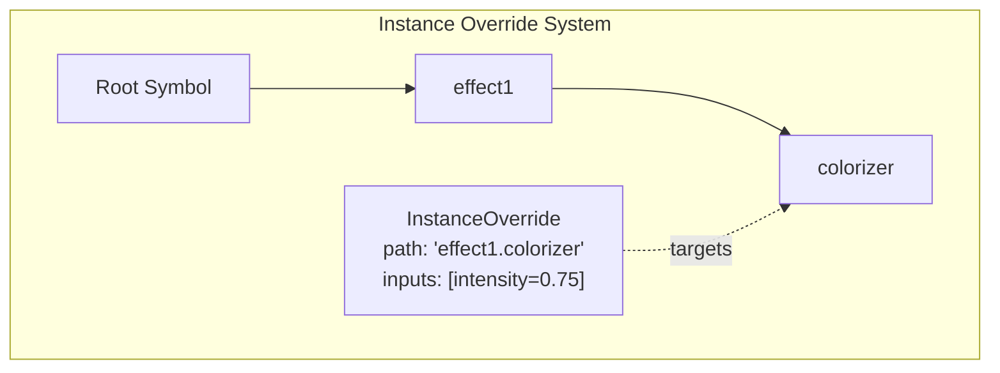
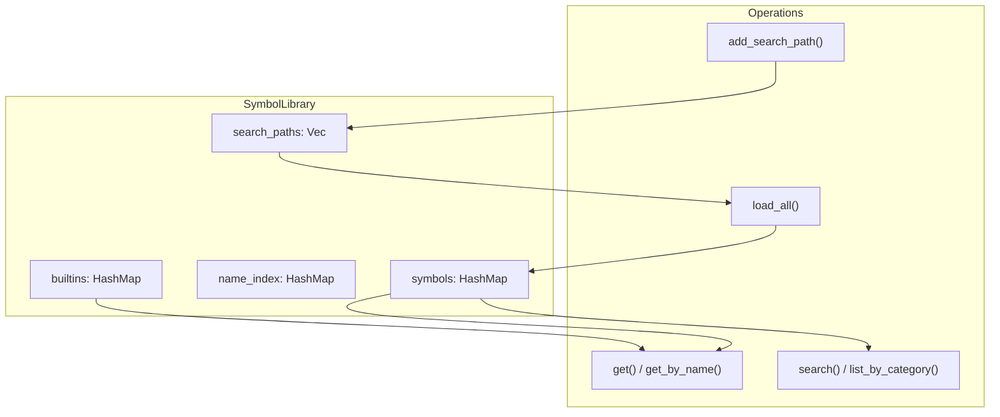
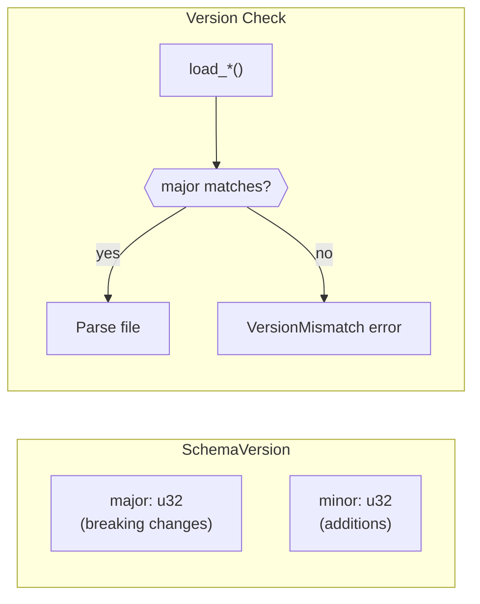

# Serialization System

This document explains Flux's serialization system for saving and loading projects, symbols, and graphs.

## Overview

Flux uses a JSON-based serialization format designed to be:

- **Human-readable** - Easy to inspect and manually edit
- **Version-aware** - Supports migrations as the format evolves
- **Modular** - Separates symbol definitions from project/graph data



## File Types

| Extension | Purpose | Contains |
|-----------|---------|----------|
| `.rproj` | Project configuration | Metadata, resource paths, entry point |
| `.rsym` | Symbol definition | Reusable operator blueprint |
| `.rgraph` | Graph/composition | Symbol instance with overrides |

## Project Files (.rproj)

The project file is the root configuration:

```rust
use flux_graph::serialization::{ProjectFile, save_project, load_project};

// Create a new project
let project = ProjectFile::new("MyProject");

// Save to disk
save_project(&project, "my_project.rproj")?;

// Load from disk
let loaded = load_project("my_project.rproj")?;
```

### Project Structure



### Example JSON

```json
{
  "version": { "major": 1, "minor": 0 },
  "project": {
    "id": "550e8400-e29b-41d4-a716-446655440000",
    "name": "Visual Effects",
    "description": "A collection of visual effects",
    "author": "Artist"
  },
  "resources": {
    "texture_dirs": ["resources/textures"],
    "audio_dirs": ["resources/audio"],
    "model_dirs": ["resources/models"],
    "shader_dirs": ["resources/shaders"]
  },
  "symbol_paths": ["symbols", "shared/symbols"],
  "main_graph": "graphs/main.rgraph"
}
```

## Symbol Files (.rsym)

Symbols are reusable operator definitions:

```rust
use flux_graph::serialization::{SymbolFile, SymbolDef, InputDef, OutputDef};
use flux_graph::serialization::{save_symbol, load_symbol};

// Create a symbol
let mut symbol = SymbolDef::new("ColorPulse")
    .with_category("Effects")
    .with_description("Pulsing color effect");

symbol.add_input(InputDef::float("Speed", 1.0).with_range(0.1, 10.0));
symbol.add_input(InputDef::color("Color", flux_core::value::Color::RED));
symbol.add_output(OutputDef::color("Result"));

// Wrap in file format
let file = SymbolFile::from_def(symbol);

// Save
save_symbol(&file, "symbols/color_pulse.rsym")?;
```

### Symbol Structure



### Child References

Children can reference:
- Built-in operators: `"builtin:add"`, `"builtin:multiply"`
- Custom symbols: symbol ID or name

```rust
use flux_graph::serialization::ChildDef;
use flux_core::Id;

// Reference a builtin
let add_child = ChildDef::builtin("add")
    .with_name("MainAdder")
    .at_position(100.0, 200.0);

// Reference a custom symbol by ID
let custom_id = Id::new();
let effect_child = ChildDef::with_id(Id::new(), &custom_id.to_string());
```

### Connections

```rust
use flux_graph::serialization::ConnectionDef;

// Connect add_child output 0 to effect_child input 0
let connection = ConnectionDef::new(
    add_child.id,    // source child
    0,               // source output index
    effect_child.id, // target child
    0,               // target input index
);
```

## Graph Files (.rgraph)

Graphs represent compositions - instances of symbols with specific configurations:

```rust
use flux_graph::serialization::{GraphFile, GraphDef, InstanceOverride};
use flux_graph::serialization::{save_graph, load_graph};
use flux_core::{Id, Value};

// Create a graph referencing a root symbol
let root_symbol_id = Id::new();
let mut graph = GraphDef::new("Main Composition", root_symbol_id)
    .with_description("The main visual output");

// Add instance overrides
graph.add_override(
    InstanceOverride::new("effect1.colorizer")
        .with_input(some_input_id, Value::Float(0.75))
);

// Configure playback
graph.playback.bpm = 140.0;
graph.playback.loop_enabled = true;

// Configure view
graph.view.camera_position = [0.0, 5.0, 10.0];
graph.view.fov = 45.0;

let file = GraphFile::new("Main", root_symbol_id);
save_graph(&file, "graphs/main.rgraph")?;
```

### Instance Overrides

Override specific instances deep in the hierarchy:



```rust
use flux_graph::serialization::{InstanceOverride, PortUiOverride};

// Override values at a path
let override_def = InstanceOverride::new("oscillator1")
    .with_input(freq_input_id, Value::Float(440.0))
    .with_port_ui(
        PortUiOverride::new(0)
            .with_range(20.0, 2000.0)
            .with_unit("Hz")
            .with_label("Fine Freq")
    );
```

### Playback Settings

```rust
pub struct PlaybackDef {
    pub bpm: f64,           // Default: 120.0
    pub start_time: f64,    // Default: 0.0
    pub end_time: f64,      // 0 = infinite
    pub loop_enabled: bool, // Default: true
}
```

### View Settings

```rust
pub struct ViewDef {
    pub camera_position: [f32; 3], // Default: [0, 0, 5]
    pub camera_target: [f32; 3],   // Default: [0, 0, 0]
    pub fov: f32,                  // Default: 60.0
}
```

## Symbol Library

The `SymbolLibrary` manages loading and caching symbols:



### Usage

```rust
use flux_graph::serialization::SymbolLibrary;

let mut library = SymbolLibrary::new();

// Add search paths
library.add_search_path("/project/symbols");
library.add_search_path("/shared/symbols");

// Load all .rsym files
let result = library.load_all();
println!("Loaded {} symbols, {} errors", result.loaded, result.errors.len());

// Access symbols
let add_symbol = library.get_by_name("builtin:add");
let custom = library.get_by_name("ColorPulse");

// Search and filter
let math_ops = library.list_by_category("Math");
let effects = library.search("effect");
```

### Built-in Symbols

The library automatically registers built-in operator symbols:

| Name | Category | Description |
|------|----------|-------------|
| `add` | Math | Adds two values |
| `multiply` | Math | Multiplies two values |
| `constant` | Math | Outputs a constant |
| `sine_wave` | Animation | Time-based sine wave |
| `lerp_color` | Color | Interpolates colors |
| `vec3_compose` | Vector | Creates Vec3 from XYZ |
| `compare` | Logic | Compares two values |
| `sum` | Math | Sums multiple inputs |

Access with `"builtin:"` prefix: `library.get_by_name("builtin:add")`

## Version Management

All files include schema version for forward compatibility:



```rust
use flux_graph::serialization::SchemaVersion;

let version = SchemaVersion::CURRENT; // 1.0
println!("Version: {}", version); // "1.0"

// Compatibility check
if version.is_compatible(1) {
    // Can load this file
}
```

### Version Mismatch

Files with incompatible major versions fail to load:

```rust
use flux_graph::serialization::{load_project_str, SerializationError};

let json = r#"{ "version": { "major": 99, "minor": 0 }, ... }"#;
match load_project_str(json) {
    Err(SerializationError::VersionMismatch { file_major, expected_major, .. }) => {
        println!("File requires v{}, we support v{}", file_major, expected_major);
    }
    _ => {}
}
```

## I/O Functions

### File Operations

```rust
use flux_graph::serialization::{
    load_project, save_project,
    load_symbol, save_symbol,
    load_graph, save_graph,
    FileType,
};

// Auto-detect file type
let file_type = FileType::from_path("my_file.rsym");
assert_eq!(file_type, FileType::Symbol);

// Get expected extension
let ext = FileType::Graph.extension(); // "rgraph"
```

### String Operations

For in-memory serialization:

```rust
use flux_graph::serialization::{
    save_project_str, load_project_str,
    save_symbol_str, load_symbol_str,
    save_graph_str, load_graph_str,
};

// Serialize to string
let project = ProjectFile::new("Test");
let json = save_project_str(&project)?;

// Parse from string
let restored = load_project_str(&json)?;
```

### Safety Features

- **File size limit**: 50 MB maximum
- **Version validation**: Rejects incompatible major versions
- **Path canonicalization**: Prevents path traversal in library search

## Typical Project Structure

```
my_project/
├── my_project.rproj       # Project configuration
├── symbols/
│   ├── effects/
│   │   ├── color_pulse.rsym
│   │   └── glow.rsym
│   └── generators/
│       └── noise.rsym
├── graphs/
│   ├── main.rgraph        # Main composition
│   └── scenes/
│       ├── intro.rgraph
│       └── outro.rgraph
└── resources/
    ├── textures/
    ├── audio/
    ├── models/
    └── shaders/
```

## Best Practices

### 1. Organize Symbols by Category

```
symbols/
├── math/
├── color/
├── effects/
└── utility/
```

### 2. Use Meaningful IDs

Symbols and graphs have stable IDs - don't regenerate them unnecessarily:

```rust
// Preserve ID when updating a symbol
let existing_id = old_symbol.id;
let mut updated = SymbolDef::with_id(existing_id, "UpdatedName");
```

### 3. Version Control Friendly

JSON format is diff-friendly. Consider:
- Using `.with_*` builders for consistent field ordering
- Running through `serde_json::to_string_pretty` for formatting

### 4. Handle Load Errors Gracefully

```rust
let result = library.load_all();
if !result.errors.is_empty() {
    for error in &result.errors {
        eprintln!("Warning: Failed to load {}: {}", error.path.display(), error.message);
    }
}
// Continue with successfully loaded symbols
```

## See Also

- [Architecture](ARCHITECTURE.md) - System overview
- [Symbol/Instance](SYMBOL_INSTANCE.md) - Runtime symbol concepts
- [Type System](TYPE_SYSTEM.md) - Value types for inputs/outputs
- [Animation System](ANIMATION_SYSTEM.md) - AnimationDef in symbols
