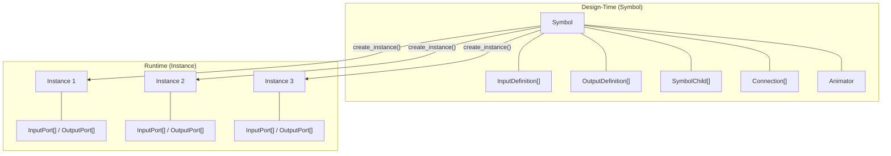
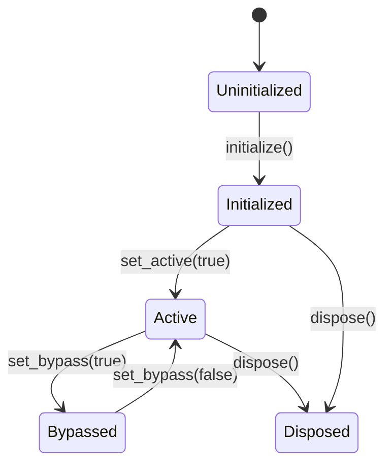
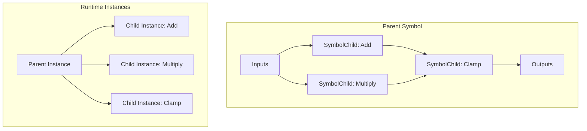

# Symbol/Instance Pattern

This document explains the Symbol/Instance separation pattern in Flux, which separates operator definitions (blueprints) from runtime state.

## Overview

Flux uses a two-level abstraction for managing operators:



| Aspect | Symbol | Instance |
|--------|--------|----------|
| **Purpose** | Definition / blueprint | Runtime state |
| **Lifetime** | Long-lived, shared | Created per-use |
| **Contains** | Definitions, structure, animation | Actual ports, values, status |
| **Mutability** | Rarely changed | Frequently updated |

## Why This Pattern?

### 1. Memory Efficiency

Multiple instances share the same symbol definition:

```rust
let symbol = Symbol::new("MyFilter");
// Define once...

let instance_a = symbol.create_instance();  // Share definition
let instance_b = symbol.create_instance();  // Share definition
let instance_c = symbol.create_instance();  // Share definition
```

### 2. Separation of Concerns

- **Symbols** define *what* an operator does (structure, ports, animations)
- **Instances** manage *runtime state* (current values, status flags)

### 3. Serialization

Symbols serialize cleanly to `.rsym` files - they're pure data describing structure, not runtime state.

## Symbol Structure

A `Symbol` contains:

```rust
pub struct Symbol {
    pub id: Id,                          // Unique identifier
    pub name: String,                    // Display name
    pub description: Option<String>,     // Documentation
    pub category: Option<String>,        // UI grouping

    pub input_definitions: Vec<InputDefinition>,
    pub output_definitions: Vec<OutputDefinition>,

    pub children: HashMap<Id, SymbolChild>,   // Nested operators
    pub connections: Vec<Connection>,         // Internal wiring

    pub animator: Animator,              // Keyframe animation
    pub is_bypassable: bool,             // Can be bypassed
}
```

### Input/Output Definitions

Definitions describe *what* ports exist without holding runtime values:

```rust
pub struct InputDefinition {
    pub id: Id,
    pub name: String,
    pub value_type: ValueType,
    pub default_value: Value,
    pub is_multi_input: bool,
}

pub struct OutputDefinition {
    pub id: Id,
    pub name: String,
    pub value_type: ValueType,
}
```

### Creating a Symbol

```rust
use flux_graph::symbol::{Symbol, InputDefinition, OutputDefinition};
use flux_core::{ValueType, Value};

let mut symbol = Symbol::new("LerpColor")
    .with_description("Linearly interpolates between two colors")
    .with_category("Color");

// Add input definitions
symbol.add_input(InputDefinition::new(
    "A",
    ValueType::Color,
    Value::Color(Color::rgb(0.0, 0.0, 0.0)),
));
symbol.add_input(InputDefinition::new(
    "B",
    ValueType::Color,
    Value::Color(Color::rgb(1.0, 1.0, 1.0)),
));
symbol.add_input(InputDefinition::float("T", 0.5));

// Add output definition
symbol.add_output(OutputDefinition::new("Result", ValueType::Color));
```

## Instance Structure

An `Instance` holds runtime state:

```rust
pub struct Instance {
    pub id: Id,                      // Unique instance ID
    pub symbol_id: Id,               // Reference to symbol
    pub instance_path: InstancePath, // Path in hierarchy

    pub inputs: Vec<InputPort>,      // Runtime input ports
    pub outputs: Vec<OutputPort>,    // Runtime output ports

    pub children: InstanceChildren,  // Child instances (lazy)
    pub status: InstanceStatus,      // Status flags
}
```

### Instance Status Flags



| Flag | Meaning |
|------|---------|
| `UNINITIALIZED` | Just created, not ready |
| `INITIALIZED` | Ready for use |
| `ACTIVE` | Currently being evaluated |
| `BYPASSED` | Skipped during evaluation |
| `IS_RECONNECTING` | Connections being updated |
| `DISPOSED` | Released, should not be used |

### Creating and Using Instances

```rust
// Create instance from symbol
let mut instance = symbol.create_instance();

// Initialize
instance.initialize();
assert!(instance.is_initialized());

// Use
instance.set_active(true);

// Access ports
if let Some(input) = instance.get_input_mut(0) {
    input.default = Value::Float(0.75);
}

// Get output value
let result = instance.get_output_value(0);

// Cleanup
instance.dispose();
```

## Hierarchical Composition

Symbols can contain child symbols, enabling hierarchical operator graphs:



### SymbolChild

References another symbol within a parent:

```rust
pub struct SymbolChild {
    pub id: Id,                    // This child's ID (unique within parent)
    pub symbol_id: Id,             // The symbol this child instantiates
    pub position: Option<[f32; 2]>, // UI position
}
```

### Adding Children

```rust
let mut parent = Symbol::new("MyComposite");

// Create child references
let add_symbol_id = registry.get_symbol_id("Add")?;
let mult_symbol_id = registry.get_symbol_id("Multiply")?;

let add_child = SymbolChild::new(Id::new(), add_symbol_id);
let mult_child = SymbolChild::new(Id::new(), mult_symbol_id);

let add_id = parent.add_child(add_child);
let mult_id = parent.add_child(mult_child);

// Connect children
parent.add_connection(Connection::new(
    SlotRef::output(add_id, 0),
    SlotRef::input(mult_id, 0),
))?;
```

## Instance Paths

When symbols are nested, `InstancePath` tracks the full path from root:

```
Root
└── CompositeA (path: [CompositeA])
    └── ChildB (path: [CompositeA, ChildB])
        └── ChildC (path: [CompositeA, ChildB, ChildC])
```

This enables:
- Context-aware caching (same operator, different paths = different cache entries)
- Debugging (see where in the hierarchy an error occurred)
- Animation targeting (animate specific nested instances)

```rust
let root_path = InstancePath::root(symbol.id);
let child_path = root_path.child(child_id);
let nested_path = child_path.child(nested_id);

// Create instance with path
let instance = symbol.create_instance_with_path(parent_path);
```

## CompositeOp: Alternative Approach

For simpler cases, `CompositeOp` provides runtime composition without the full Symbol/Instance machinery:

```rust
use flux_graph::composite::CompositeOp;

// Create composite
let mut composite = CompositeOp::new("AddAndClamp");

// Add internal operators
let add_id = composite.add(AddOp::new());
let clamp_id = composite.add(ClampOp::new());

// Connect internally
composite.connect_internal(add_id, 0, clamp_id, 0)?;

// Expose ports
composite.expose_input("A", add_id, 0)?;
composite.expose_input("B", add_id, 1)?;
composite.expose_output("Result", clamp_id, 0)?;

// Use like any operator
let composite_id = graph.add(composite);
```

### Symbol vs CompositeOp

| Aspect | Symbol/Instance | CompositeOp |
|--------|-----------------|-------------|
| Use case | Complex, reusable definitions | Simple runtime grouping |
| Serialization | Full support (.rsym files) | Limited |
| Animation | Full Animator support | Not built-in |
| Memory | Shared definitions | Self-contained |
| Setup | More boilerplate | Quick and easy |

## Symbol Registry

Store and retrieve symbols by ID:

```rust
use flux_graph::symbol::SymbolRegistry;

let mut registry = SymbolRegistry::new();

// Register symbols
registry.register(add_symbol);
registry.register(multiply_symbol);
registry.register(my_composite);

// Retrieve
let symbol = registry.get(symbol_id)?;
let symbol = registry.get_by_name("Add")?;

// List all
for (id, symbol) in registry.iter() {
    println!("{}: {}", symbol.name, id);
}
```

## Lazy Child Instantiation

Child instances are created lazily through `InstanceChildren`:

```rust
pub struct InstanceChildren {
    symbol_id: Id,
    instances: HashMap<Id, Instance>,    // Created on demand
    instantiated: HashMap<Id, bool>,     // Track what's been created
}
```

This means:
- Children aren't instantiated until needed
- Memory is conserved for unused branches
- You can check `is_instantiated(child_id)` before accessing

```rust
// Check before accessing
if !instance.children.is_instantiated(child_id) {
    // Create the child instance
    let child_symbol = registry.get(child_symbol_id)?;
    let child_instance = child_symbol.create_instance_with_path(instance.instance_path.clone());
    instance.children.insert(child_id, child_instance);
}

// Now access
let child = instance.children.get_mut(child_id).unwrap();
```

## Best Practices

### 1. Share Symbols, Not Instances

```rust
// Good: One symbol, multiple instances
let symbol = create_filter_symbol();
let instance_a = symbol.create_instance();
let instance_b = symbol.create_instance();

// Bad: Duplicating symbol definitions
let symbol_a = create_filter_symbol();  // Wasteful
let symbol_b = create_filter_symbol();  // Wasteful
```

### 2. Use SymbolRegistry for Lookups

```rust
// Store in registry once
registry.register(symbol);

// Look up when needed
let symbol = registry.get(symbol_id)?;
let instance = symbol.create_instance();
```

### 3. Dispose Instances When Done

```rust
instance.dispose();  // Releases resources, disposes children
```

### 4. Use Instance Paths for Debugging

```rust
println!("Error at path: {:?}", instance.instance_path);
// Output: Error at path: [Root, Composite, Filter, Clamp]
```

## See Also

- [Architecture](ARCHITECTURE.md) - System overview
- [Operator Guide](OPERATOR_GUIDE.md) - Creating operators
- [Graph Evaluation](GRAPH_EVALUATION.md) - How instances are evaluated
- [Example 09: Composite Operators](../examples/09_composite_operators.rs)
